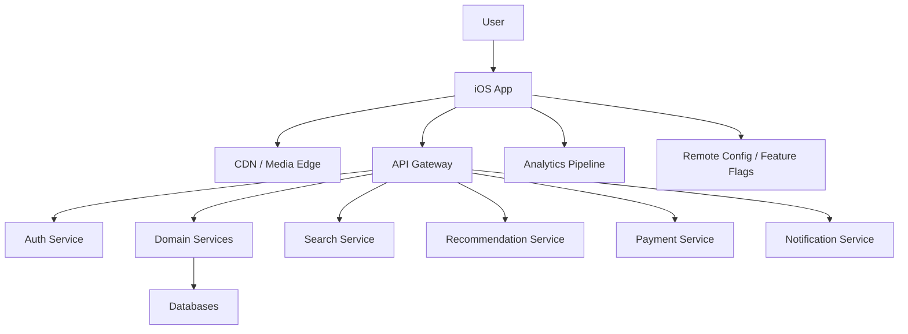
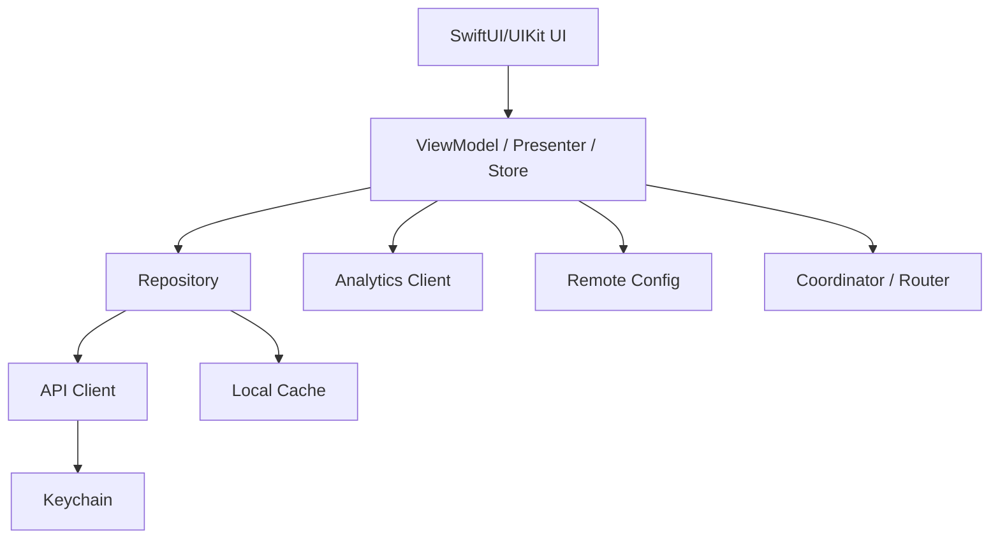

# Day 38: High-Level Design For iOS App Ecosystem

High-level design explains the system from a bird's-eye view. For iOS, HLD should include the mobile app, backend services, CDN, authentication, analytics, notifications, experimentation, observability, and release strategy.

## Generic Large-Scale iOS App HLD



## iOS App Internal HLD



## Major Client Components

### App Shell

Responsibilities:

- App launch.
- Dependency setup.
- Auth/session routing.
- Tab/navigation root.
- Deep link entry.
- Push notification handling.
- Remote config fetch.

### Feature Modules

Examples:

- Home.
- Search.
- Details.
- Cart.
- Checkout.
- Profile.
- Downloads.
- Notifications.

Each module should own:

- Screens.
- View models.
- View state.
- Feature-specific repositories.
- Feature-specific mappers.

### Core Modules

Examples:

- Networking.
- Auth.
- Logging.
- Analytics.
- Image loading.
- Persistence.
- Design system.
- Feature flags.
- Localization.

## Backend Service Boundaries

For large apps, backend is split by domain:

- Auth service.
- User service.
- Catalog/content service.
- Search service.
- Recommendation service.
- Order service.
- Payment service.
- Notification service.
- Analytics ingestion.

The iOS app should not know internal microservice details. It should communicate through stable APIs, usually behind a gateway or BFF.

## BFF Pattern

BFF means Backend For Frontend.

Why useful:

- Mobile-specific payloads.
- Fewer round trips.
- Server-driven layout if needed.
- Easier API evolution.
- Client gets data already shaped for screens.

Example:

```text
GET /ios/home
```

Instead of:

```text
GET /user
GET /recommendations
GET /continue-watching
GET /promotions
GET /notifications
```

Senior tradeoff:

- BFF improves mobile performance.
- But it can become too screen-specific if poorly governed.

## App Startup HLD

Startup flow:

1. Launch app.
2. Initialize logging/crash reporting.
3. Load local session from Keychain.
4. Load remote config with timeout.
5. Choose initial route.
6. Display cached initial content if available.
7. Refresh data in background.

Senior note: do not block app launch indefinitely waiting for remote config.

## Data Flow

```text
API Response -> DTO -> Domain Model -> View State -> Row Model -> UI
```

Why:

- API changes do not directly break UI.
- UI gets display-ready data.
- Business rules live outside views.
- Testing becomes easier.

## Analytics Flow

Analytics should be:

- Non-blocking.
- Batched.
- Privacy-aware.
- Schema-controlled.
- Testable.

Example events:

- Screen viewed.
- Product impression.
- Video play started.
- Add to cart.
- Checkout failed.
- Search submitted.

Senior note: analytics should not drive critical product state.

## Observability Flow

The app should emit:

- Crash reports.
- Non-fatal errors.
- Network latency.
- API failure codes.
- Screen load times.
- Video playback startup time.
- Cache hit rate.
- Feature flag assignment.

This helps diagnose production behavior.

## HLD Interview Checklist

- User flows.
- Major app modules.
- Backend services.
- API gateway/BFF.
- CDN.
- Auth/session.
- Local storage.
- Cache strategy.
- Push notifications.
- Analytics.
- Observability.
- Security.
- Release/feature flags.

## Common Mistakes

- Drawing only backend services.
- Ignoring app startup.
- Ignoring mobile network.
- No local cache.
- No analytics/observability.
- No feature flags.
- No old app compatibility.
- No clear ownership boundaries.

