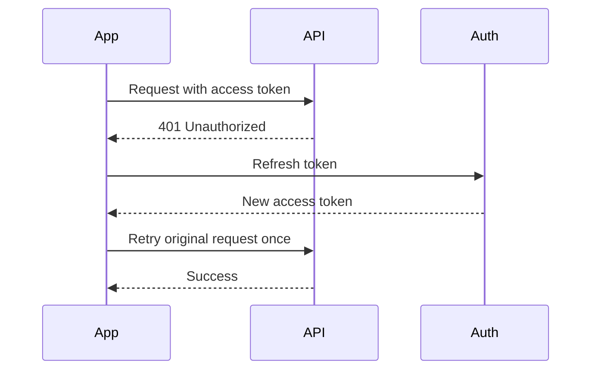

# Day 38: Client-Server Communication Process

Communication design is central to iOS system design. Large apps are not just screens calling APIs. They coordinate auth, retries, caching, pagination, errors, observability, token refresh, background work, and backward-compatible contracts.

## Basic Request Flow

```text
View -> ViewModel -> Repository -> APIClient -> URLSession -> Backend
Backend -> URLSession -> APIClient -> Repository -> ViewModel -> View
```

## API Client Responsibilities

An API client should handle:

- Base URL.
- Request building.
- Headers.
- Authentication token.
- Encoding body.
- Decoding response.
- Status-code handling.
- Typed errors.
- Request IDs.
- Logging.
- Retry policy.
- Token refresh.

## Request Model

```swift
enum HTTPMethod: String {
    case get = "GET"
    case post = "POST"
    case put = "PUT"
    case delete = "DELETE"
}

struct APIRequest<Response: Decodable> {
    let path: String
    let method: HTTPMethod
    let queryItems: [URLQueryItem]
    let body: Encodable?
    let requiresAuth: Bool
}
```

## Response Handling

```swift
enum APIClientError: Error {
    case invalidURL
    case transport(Error)
    case unauthorized
    case server(statusCode: Int, requestID: String?)
    case decoding(Error)
    case unknown
}
```

Senior note: distinguish transport errors, server errors, decoding errors, and auth errors.

## Token Refresh Flow



Important rules:

- Retry unauthorized request once.
- Avoid infinite loops.
- Coordinate simultaneous refresh calls.
- Store refresh token securely in Keychain.
- Logout if refresh fails.

## Actor-Based Token Refresh

```swift
actor TokenManager {
    private var accessToken: String?
    private var refreshTask: Task<String, Error>?
    private let authService: AuthService

    init(authService: AuthService) {
        self.authService = authService
    }

    func token() -> String? {
        accessToken
    }

    func refresh() async throws -> String {
        if let refreshTask {
            return try await refreshTask.value
        }

        let task = Task { [authService] in
            try await authService.refreshToken()
        }

        refreshTask = task

        do {
            let token = try await task.value
            accessToken = token
            refreshTask = nil
            return token
        } catch {
            refreshTask = nil
            throw error
        }
    }
}
```

## Retry Policy

Retry only when it is safe:

- Network timeout.
- Temporary server failure.
- Rate limiting after delay.

Avoid retrying:

- Invalid request.
- Payment failure.
- Auth failure without refresh.
- Non-idempotent writes without idempotency key.

```swift
struct RetryPolicy {
    let maxAttempts: Int
    let baseDelayMilliseconds: Int

    func delay(for attempt: Int) -> Duration {
        .milliseconds(baseDelayMilliseconds * (1 << max(0, attempt - 1)))
    }
}
```

## Idempotency For Writes

For order creation:

```http
POST /orders
Idempotency-Key: order_attempt_123
```

Why iOS needs this:

- User taps twice.
- App retries after timeout.
- Network response lost.
- App is killed after request.

## Request Cancellation

Search and scrolling requests should be cancellable.

```swift
private var searchTask: Task<Void, Never>?

func search(query: String) {
    searchTask?.cancel()
    searchTask = Task {
        let results = try await service.search(query)
        try Task.checkCancellation()
        await MainActor.run {
            self.render(results)
        }
    }
}
```

## Pagination Communication

Cursor-based request:

```http
GET /products?cursor=abc&pageSize=20
```

Response:

```json
{
  "items": [],
  "nextCursor": "def"
}
```

iOS state:

- `isLoadingFirstPage`
- `isRefreshing`
- `isLoadingNextPage`
- `nextCursor`
- `paginationError`

## Cache Headers

Backend can send:

```http
Cache-Control: max-age=3600
ETag: "abc123"
```

iOS can use:

```http
If-None-Match: "abc123"
```

Server response:

```http
304 Not Modified
```

Senior note: images and media should usually go through CDN caching, while personalized API data needs stricter policies.

## Observability In Communication

Track:

- Request path.
- Status code.
- Latency.
- Request ID.
- Retry count.
- Cache hit/miss.
- Decoding failure.
- Network reachability.

Do not log:

- Tokens.
- Passwords.
- Payment details.
- Personal sensitive data.

## Communication Interview Checklist

- API client abstraction.
- Auth headers.
- Token refresh.
- Retry/backoff.
- Idempotency.
- Pagination.
- Cancellation.
- Timeout.
- Cache validation.
- Typed errors.
- Observability.
- Security.

## Common Mistakes

- Retrying all requests blindly.
- Infinite token refresh loop.
- No idempotency for writes.
- No request cancellation.
- UI receives raw network errors.
- Logs contain tokens.
- Pagination state is mixed with initial loading state.

