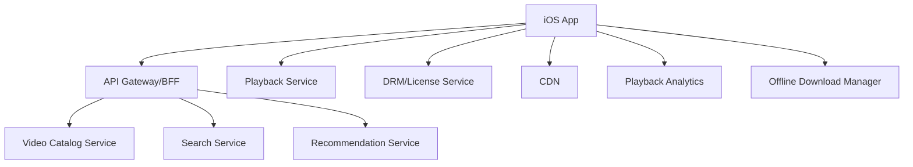

# Day 38: Video Streaming App System Design - Netflix And YouTube Style

This topic uses Netflix-like and YouTube-like apps as product examples. It does not claim private internal implementation details. The goal is to understand how to design a large-scale video streaming iOS app with playback, feed, search, recommendations, offline downloads, analytics, and reliability.

## Core Requirements

User can:

- Browse home feed.
- Search videos.
- View video details.
- Play video.
- Pause/resume.
- Continue watching.
- Like/save/share.
- See recommendations.
- Download for offline viewing.
- Receive notifications.

Non-functional:

- Fast startup.
- Low playback start time.
- Smooth playback.
- Adaptive bitrate.
- Offline playback.
- Low battery usage.
- DRM/security.
- Analytics and quality tracking.

## High-Level Design



## iOS Modules

```text
HomeFeature
SearchFeature
VideoDetailsFeature
PlayerFeature
DownloadsFeature
ProfileFeature
RecommendationClient
PlaybackSessionManager
DownloadManager
AnalyticsClient
ImageLoader
MediaCache
```

## Video Playback Flow

1. User taps video.
2. App fetches playback metadata.
3. Backend returns stream manifest URL.
4. App requests DRM license if needed.
5. Player loads manifest from CDN.
6. Adaptive bitrate chooses quality.
7. App tracks playback events.
8. Continue-watching progress is synced.

## Player State Model

```swift
enum PlayerState: Equatable {
    case idle
    case loading(videoID: String)
    case ready(videoID: String)
    case playing(videoID: String)
    case paused(videoID: String, position: TimeInterval)
    case buffering(videoID: String)
    case failed(videoID: String, message: String)
    case ended(videoID: String)
}
```

Senior note: buffering is not failure. Treat it as its own state.

## Continue Watching

Local:

- Save progress periodically.
- Save on pause/background.
- Save on app termination if possible.

Remote:

- Sync progress to server.
- Resolve latest progress across devices.
- Avoid sending every second; batch or throttle.

Example model:

```swift
struct WatchProgress: Codable, Equatable {
    let videoID: String
    let position: TimeInterval
    let duration: TimeInterval
    let updatedAt: Date
}
```

## Offline Downloads

Download concerns:

- User permission/storage.
- Download quality.
- Expiration.
- DRM license expiry.
- Network constraints.
- Wi-Fi only setting.
- Background download.
- Resume after interruption.
- Delete downloads.

iOS module:

```swift
protocol VideoDownloadManaging {
    func startDownload(videoID: String, quality: VideoQuality) async throws
    func pauseDownload(videoID: String)
    func resumeDownload(videoID: String)
    func deleteDownload(videoID: String) async throws
}
```

## Feed And Recommendations

Home feed may include:

- Continue watching.
- Trending.
- Personalized recommendations.
- New releases.
- Subscriptions.
- Watch again.

Use sectioned state:

```swift
enum HomeSection: Hashable {
    case continueWatching
    case recommended
    case trending
    case subscriptions
}
```

## Search Design

Search should handle:

- Debounce.
- Cancellation.
- Recent searches.
- Suggestions.
- Empty result.
- Network error.
- Trending fallback.

Senior note: stale search results are a common bug. Track query identity or cancel previous task.

## Playback Analytics

Track:

- Playback start.
- Startup time.
- Buffer start/end.
- Bitrate changes.
- Dropped frames.
- Error codes.
- Watch duration.
- User pause/seek.
- Download start/fail/success.

Do not block playback on analytics.

## Performance Concerns

- Image loading for thumbnails.
- Prefetch visible rows.
- Avoid huge memory spikes from thumbnails.
- Use CDN image sizes.
- Keep player screen lightweight.
- Avoid reinitializing player unnecessarily.
- Minimize main-thread work during playback.

## Failure Handling

Failure cases:

- Manifest unavailable.
- DRM license failure.
- CDN timeout.
- Network drops mid-playback.
- Download storage full.
- Expired offline license.
- App backgrounded.

Good UX:

- Retry playback.
- Show quality fallback.
- Keep watch progress.
- Resume download.
- Explain offline expiry.

## Interview Answer Example

```text
For a Netflix-like iOS app, I would separate home feed, search, player, downloads, and analytics modules. Video metadata comes from APIs, media segments from CDN, and playback license from DRM service. The player has explicit states like loading, ready, playing, buffering, paused, failed, and ended. I would track quality metrics without blocking playback, sync watch progress with throttling, and support offline downloads with license expiry and background resume.
```

## Common Mistakes

- Treating video as normal JSON content.
- Ignoring CDN.
- No buffering state.
- No offline license handling.
- Sending analytics too frequently.
- No stale search protection.
- No continue-watching conflict strategy.
- Rebuilding player on every UI update.

