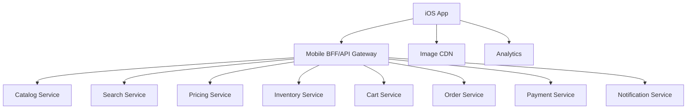

# Day 38: E-Commerce App System Design - Amazon And Flipkart Style

This topic uses Amazon-like and Flipkart-like apps as product-scale examples. It does not describe private internal systems. The goal is to design a large iOS commerce app with catalog, search, cart, checkout, payments, offers, order tracking, notifications, and reliability.

## Core Requirements

User can:

- Browse products.
- Search and filter.
- View product details.
- Add to cart.
- Save wishlist.
- Apply coupons.
- Checkout.
- Pay.
- Track orders.
- Cancel/return/refund.
- Receive offers and order updates.

Non-functional:

- Accurate price and inventory.
- Secure payment.
- Fast search.
- Smooth scrolling.
- Resilient checkout.
- Idempotent order creation.
- Offline tolerance for browsing cached data.

## High-Level Design



## iOS Feature Modules

```text
Home
Search
ProductList
ProductDetails
Cart
Checkout
Payment
Orders
Wishlist
Profile
Notifications
```

Core modules:

```text
APIClient
AuthSession
ImageLoader
PriceFormatter
CartStore
FeatureFlags
Analytics
DeepLinkRouter
LocalCache
```

## Product List State

```swift
enum ProductListState {
    case loading
    case loaded(ProductListContent)
    case empty
    case failed(String)
}

struct ProductListContent {
    let rows: [ProductRow]
    let filters: [Filter]
    let sortOption: SortOption
    let nextCursor: String?
    let isLoadingNextPage: Bool
}
```

## Product Details Data

Product details may need:

- Product metadata.
- Images/videos.
- Price.
- Offers.
- Inventory.
- Delivery estimate.
- Reviews.
- Recommendations.

Question: one API or many?

Senior answer:

- A BFF endpoint can reduce mobile round trips.
- Highly dynamic fields like price/inventory may need separate freshness.
- Use skeleton loading for partial sections.

## Cart Design

Cart source of truth is usually server for logged-in users.

Local cart may be used for:

- Guest user.
- Offline add intent.
- Faster startup display.

Cart item model:

```swift
struct CartItem: Identifiable, Equatable {
    let id: String
    let productID: String
    var quantity: Int
    let selectedVariantID: String?
}
```

Cart risks:

- Price changed.
- Item out of stock.
- Coupon expired.
- Quantity unavailable.
- User logged in on another device.

## Checkout Flow

Checkout should be state-driven.

```swift
enum CheckoutState {
    case reviewing(CheckoutSummary)
    case validating
    case paymentRequired(PaymentContext)
    case placingOrder
    case success(OrderConfirmation)
    case failed(message: String, retryable: Bool)
}
```

Senior note: checkout is not just one API call. It is a multi-step flow with validation, payment, order creation, and confirmation.

## Idempotent Order Creation

Use idempotency key:

```swift
struct CreateOrderRequest: Encodable {
    let cartID: String
    let addressID: String
    let paymentMethodID: String
    let idempotencyKey: String
}
```

Why:

- Network timeout after payment.
- User retries.
- App crashes.
- Duplicate taps.

Server should return same order for same key.

## Payment Design

Security:

- Do not store card data in app.
- Use payment provider SDK or tokenization.
- Use HTTPS/ATS.
- Store only safe tokens if required.
- Handle payment callback/deep link.

Payment states:

- started
- requires authentication
- processing
- succeeded
- failed
- cancelled

## Search And Filters

Search concerns:

- Debounce query.
- Cancel stale requests.
- Persist recent searches.
- Show suggestions.
- Apply filters.
- Sort results.
- Paginate.

Filter model:

```swift
struct ProductFilter: Hashable {
    let id: String
    let title: String
    let options: [FilterOption]
}
```

## Order Tracking

Order tracking can use:

- Polling.
- Push notifications.
- Server-sent updates through backend if supported.

iOS behavior:

- Show cached order status.
- Refresh on open.
- Update from push notification.
- Deep link to order details.

## Analytics

Track:

- Product impressions.
- Product taps.
- Search query.
- Filter applied.
- Add to cart.
- Remove from cart.
- Checkout started.
- Payment failed.
- Order placed.

Senior note: analytics events need stable schema and should not block checkout.

## Failure Handling

Important failures:

- Product unavailable.
- Price changed.
- Cart sync failed.
- Coupon invalid.
- Payment failed.
- Order status unknown.
- Address invalid.
- Network timeout.

Good UX:

- Keep user in context.
- Explain recovery.
- Avoid duplicate charges.
- Refresh cart before payment.
- Show order status lookup after uncertain payment result.

## Interview Answer Example

```text
For an Amazon-like iOS app, I would split catalog, search, cart, checkout, payment, orders, and notification features. The iOS app talks to a mobile BFF that composes product detail data. Cart and checkout require strong consistency, idempotent writes, tokenized payments, and careful failure handling. Product lists can be cached and paginated, but price/inventory should be refreshed before checkout.
```

## Common Mistakes

- Treating price as static.
- No idempotency key for order creation.
- Storing card details locally.
- Cart state only local for logged-in users.
- No handling for payment uncertainty.
- No stale search cancellation.
- Product DTO directly used in UI.
- No analytics for funnel drop-off.

