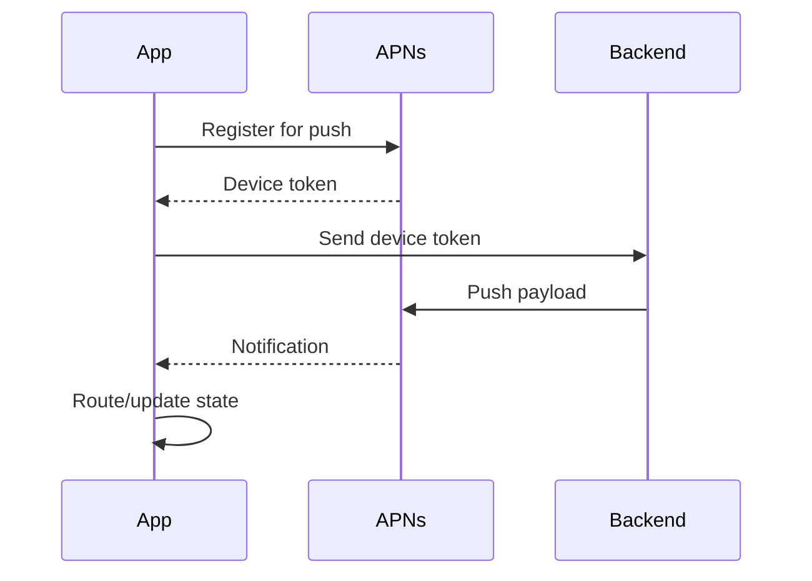

# Day 38: Realtime, Notifications, And Deep Links

Realtime updates, push notifications, and deep links connect the iOS app to the outside world. They are essential for messaging, commerce, video, delivery, banking, and social apps.

## Push Notification Flow



## Notification Types

- Transactional: order update, payment, delivery.
- Engagement: offers, recommendations.
- Social: likes, comments, messages.
- System: security alert, login notification.

## iOS Handling

App states:

- Foreground.
- Background.
- Terminated.

Behavior differs by state. In foreground, you may show in-app banner instead of system alert.

## Notification Payload

```json
{
  "aps": {
    "alert": {
      "title": "Order shipped",
      "body": "Your order is on the way."
    },
    "sound": "default"
  },
  "route": "app://orders/123",
  "eventID": "evt_456"
}
```

## Deep Link Router

```swift
enum AppRoute: Equatable {
    case product(id: String)
    case order(id: String)
    case video(id: String)
    case search(query: String)
    case unknown
}

struct DeepLinkParser {
    func parse(_ url: URL) -> AppRoute {
        let components = url.pathComponents

        if components.contains("orders"), let id = components.last {
            return .order(id: id)
        }

        if components.contains("products"), let id = components.last {
            return .product(id: id)
        }

        return .unknown
    }
}
```

## Routing With Auth

Deep links may require login.

Flow:

```text
Receive route -> Check auth -> If logged in, route -> If not, show login -> Route after login
```

Senior note: keep pending route and replay after successful auth.

## Realtime Options

Options:

- Push notifications.
- Polling.
- WebSocket.
- Server-sent events.
- Silent push.

Use polling for:

- Order status every few seconds/minutes.
- Simple low-frequency updates.

Use WebSocket for:

- Chat.
- Live collaboration.
- Trading.
- Live sports.

Use push for:

- App not active.
- Important user-visible events.

## Chat App Realtime Design

iOS modules:

- ConversationList.
- ChatRoom.
- MessageStore.
- RealtimeConnection.
- AttachmentUploader.
- PushNotificationRouter.

Message states:

```swift
enum MessageDeliveryState {
    case sending
    case sent
    case delivered
    case read
    case failed
}
```

## Deduplication

Realtime systems often deliver duplicates.

Use stable IDs:

```swift
func mergeMessages(existing: [Message], incoming: [Message]) -> [Message] {
    var byID = Dictionary(uniqueKeysWithValues: existing.map { ($0.id, $0) })

    for message in incoming {
        byID[message.id] = message
    }

    return byID.values.sorted { $0.createdAt < $1.createdAt }
}
```

## Notification Observability

Track:

- Token registration success/failure.
- Notification received.
- Notification opened.
- Route success/failure.
- Permission status.

## Common Mistakes

- Deep link directly creates random view controller.
- No auth gate for protected route.
- Duplicate messages.
- No route fallback.
- Push payload contains sensitive data.
- Assuming silent push always arrives.
- No notification permission strategy.

## Interview Answer Example

```text
I would model notifications as routes plus metadata. The app registers with APNs, sends token to backend, receives payloads, parses route, checks auth, and navigates through a central router. For realtime chat, I would use WebSocket while active, push while inactive, deduplicate by message ID, and store delivery state locally.
```

