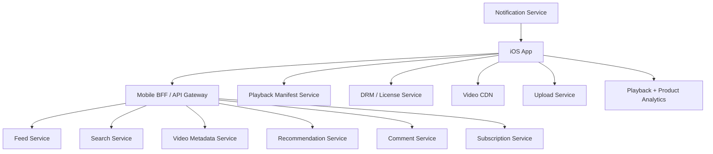

# Day 38: Design YouTube For iOS

This is a senior iOS architect-style answer for designing a YouTube-like iOS app. The goal is not to reproduce YouTube's private architecture. The goal is to show how you would design a large-scale video, feed, search, recommendation, creator, and playback experience on iOS.

## 1. Clarify Requirements

Core user flows:

- Browse personalized home feed.
- Search videos/channels/playlists.
- Watch video with adaptive streaming.
- Like, dislike, save, share, comment.
- Subscribe to channels.
- Continue watching across devices.
- Download videos for offline viewing if allowed.
- Upload videos if creator mode is in scope.
- Receive notifications for subscriptions and recommendations.

Non-functional requirements:

- Fast app launch and fast first feed render.
- Low video startup time.
- Smooth playback under changing network.
- Excellent scroll performance.
- Offline tolerance for cached metadata and downloaded videos.
- Battery-conscious playback and download behavior.
- Accessibility, captions, localization.
- Strong analytics and playback observability.

Out of scope unless interviewer asks:

- Full backend video transcoding pipeline.
- Creator monetization.
- Ads auction details.
- Copyright detection.

## 2. High-Level Design



## 3. iOS App Modules

```text
AppShell
AuthSession
HomeFeedFeature
SearchFeature
VideoDetailsFeature
PlayerFeature
CommentsFeature
SubscriptionsFeature
DownloadsFeature
UploadFeature
NotificationsFeature
AnalyticsCore
ImageLoader
PlaybackCore
DeepLinkRouter
FeatureFlags
```

Senior module rule: the player should be a core capability, not hidden inside the feed. Home, search, downloads, and details can all launch playback.

## 4. Feed Design

Home feed sections:

- Recommended.
- Shorts.
- Subscriptions.
- Continue watching.
- Trending.
- Recently uploaded.

Feed state:

```swift
enum HomeFeedState: Equatable {
    case loading
    case loaded(HomeFeedContent)
    case empty
    case failed(message: String)
}

struct HomeFeedContent: Equatable {
    var sections: [HomeFeedSection]
    var nextCursor: String?
    var isRefreshing: Bool
    var isLoadingNextPage: Bool
    var paginationError: String?
}

struct HomeFeedSection: Equatable, Identifiable {
    let id: String
    let title: String
    let items: [VideoCardRow]
}
```

Feed communication:

```http
GET /ios/home?cursor=abc&pageSize=20
```

Why cursor pagination:

- Personalized ranking changes often.
- New videos can arrive while user scrolls.
- Page number pagination can duplicate or skip items.

## 5. Video Playback Design

Playback flow:

1. User taps video.
2. App fetches playback metadata.
3. Backend returns stream manifest URL and playback constraints.
4. App requests DRM/license if required.
5. Player loads adaptive stream from CDN.
6. App tracks startup, buffering, bitrate, errors, watch time.
7. App periodically syncs watch progress.

Player state:

```swift
enum VideoPlayerState: Equatable {
    case idle
    case loading(videoID: String)
    case ready(videoID: String)
    case playing(videoID: String)
    case paused(videoID: String, position: TimeInterval)
    case buffering(videoID: String, position: TimeInterval)
    case failed(videoID: String, message: String, retryable: Bool)
    case ended(videoID: String)
}
```

Senior point: buffering should not be modeled as failure. It has different UX and retry behavior.

## 6. Continue Watching

Local progress:

```swift
struct WatchProgress: Codable, Equatable {
    let videoID: String
    var position: TimeInterval
    let duration: TimeInterval
    var updatedAt: Date
}
```

Sync strategy:

- Save locally every few seconds or on important events.
- Throttle remote updates.
- Save when app backgrounds.
- Resolve multi-device progress using latest timestamp.

Tradeoff:

- Frequent progress sync improves cross-device continuity but increases network and battery use.
- Throttled sync is usually better.

## 7. Search Design

Search features:

- Query suggestions.
- Recent searches.
- Debounced search.
- Cancellation.
- Result pagination.
- Filters: video, channel, playlist, date.

Search state:

```swift
enum VideoSearchState: Equatable {
    case idle
    case suggestions([String])
    case loading(query: String)
    case results(query: String, rows: [VideoCardRow], nextCursor: String?)
    case empty(query: String)
    case failed(query: String, message: String)
}
```

Important bug to avoid: stale query results replacing newer results.

## 8. Comments Design

Comments are a separate feature:

- Fetch top comments.
- Paginate replies.
- Post comment.
- Edit/delete own comment.
- Like/comment moderation state.

Write actions should use optimistic UI carefully:

- Show pending comment locally.
- Replace with server-confirmed comment.
- Mark failed if post fails.

```swift
enum CommentDeliveryState {
    case sending
    case sent
    case failed
}
```

## 9. Offline Downloads

Download considerations:

- Storage limit.
- Wi-Fi only setting.
- Quality selection.
- Background download support.
- Expiry rules.
- DRM license expiry.
- Partial download recovery.

Tradeoff:

- Higher quality improves UX but consumes storage.
- Auto-download improves convenience but may hurt battery/storage/network.

## 10. Analytics And Observability

Track playback:

- Video startup time.
- Time to first frame.
- Buffer count/duration.
- Playback failure.
- Bitrate changes.
- Dropped frames.
- Watch duration.

Track product:

- Impression.
- Tap.
- Search.
- Subscribe.
- Like.
- Share.
- Comment.

Senior point: analytics must be non-blocking and privacy-aware.

## 11. Security And Privacy

Design points:

- Auth tokens in Keychain.
- ATS for network.
- DRM license flow for protected videos.
- Do not log tokens or user-sensitive activity.
- Respect privacy preferences.
- Captions/accessibility support.
- Parental controls if in scope.

## 12. LLD Example

```swift
protocol HomeFeedRepository {
    func loadHomeFeed(cursor: String?) async throws -> HomeFeedPage
}

protocol PlaybackRepository {
    func playbackMetadata(videoID: String) async throws -> PlaybackMetadata
    func saveProgress(_ progress: WatchProgress) async throws
}

struct HomeFeedPage {
    let sections: [HomeFeedSection]
    let nextCursor: String?
}
```

## 13. Tradeoffs

| Decision | Option A | Option B | Senior Recommendation |
|---|---|---|---|
| Feed API | Generic content API | Mobile BFF | BFF for fewer round trips and mobile-shaped payloads |
| Playback analytics | Send every event immediately | Batch/throttle | Batch non-critical analytics |
| Progress sync | Every second | Throttled + lifecycle events | Throttle to reduce network/battery |
| Search | Fire every keystroke | Debounce/cancel | Debounce and cancel |
| Offline video | Always highest quality | User/device/network aware | Let user choose, default smartly |

## 14. Strong Interview Answer

```text
I would split the app into feed, search, player, comments, subscriptions, downloads, and analytics modules. The feed uses cursor pagination and stable IDs. The player fetches playback metadata, loads adaptive streams from CDN, handles DRM if needed, and models loading, buffering, playing, paused, failed, and ended states explicitly. Continue-watching progress is saved locally and synced with throttling. Search uses debounce and cancellation to avoid stale results. I would track playback quality metrics separately from product analytics and keep all analytics non-blocking.
```

## 15. Senior Architect Artifact Walkthrough

In a real senior interview, I would not only describe features. I would create artifacts that prove I can reason about product scale, ownership, failure, and evolution.

### Artifact 1: Requirement Boundary Document

What I would capture:

- Is this only video watching or also creator upload?
- Is offline download in scope?
- Are ads in scope?
- Is DRM required?
- Are comments and subscriptions required?
- What is target startup/playback latency?

My thinking:

```text
I first reduce ambiguity. If upload, ads, and creator tooling are in scope, the system becomes much larger. For a 45-minute interview, I would explicitly scope to viewer experience: home feed, search, playback, comments, subscriptions, downloads, and watch progress.
```

### Artifact 2: HLD Component Diagram

What I would draw:

- iOS app.
- Mobile BFF.
- Feed service.
- Search service.
- Recommendation service.
- Video metadata service.
- Playback manifest service.
- CDN.
- DRM/license service.
- Analytics pipeline.

My thinking:

```text
Video streaming is CDN-first. The app should not stream video bytes from normal API services. APIs provide metadata and manifests; CDN serves media segments. This separation is the heart of the design.
```

### Artifact 3: iOS Module Ownership Map

What I would define:

```text
HomeFeedFeature owns feed rendering.
SearchFeature owns query/search state.
PlayerFeature owns playback state and controls.
PlaybackCore wraps AVFoundation/player concerns.
DownloadsFeature owns offline download state.
AnalyticsCore owns event batching.
```

My thinking:

```text
I keep PlaybackCore separate from VideoDetails or HomeFeed because many entry points launch playback. This avoids duplicated player behavior and makes playback quality instrumentation consistent.
```

### Artifact 4: Playback State Machine

Why it matters:

- Playback is not just `isPlaying`.
- Buffering, ready, failed, paused, and ended need distinct UI.
- Analytics depends on state transitions.

State artifact:

```swift
enum VideoPlayerState {
    case idle
    case loading(videoID: String)
    case ready(videoID: String)
    case playing(videoID: String)
    case buffering(videoID: String, position: TimeInterval)
    case paused(videoID: String, position: TimeInterval)
    case failed(videoID: String, message: String, retryable: Bool)
    case ended(videoID: String)
}
```

My thinking:

```text
If the candidate models player state with a few booleans, I would push on invalid combinations. Can it be buffering and failed at the same time? Can it be loading without a video ID? A state machine prevents those bugs.
```

### Artifact 5: API Contract Sketch

Playback metadata:

```json
{
  "videoID": "v_123",
  "title": "System Design for iOS",
  "manifestURL": "https://cdn.example.com/v_123/master.m3u8",
  "licenseURL": "https://license.example.com/v_123",
  "captions": [
    { "language": "en", "url": "https://cdn.example.com/captions/en.vtt" }
  ],
  "startPosition": 128.4
}
```

My thinking:

```text
The app needs enough metadata to start playback quickly. Captions and resume position are playback-adjacent, so I would either include them in metadata or fetch them with predictable parallel requests.
```

### Artifact 6: Watch Progress Sync Design

Decision:

- Save locally often.
- Sync remotely with throttling.
- Sync on pause/background/end.
- Resolve multi-device conflicts by latest timestamp.

My thinking:

```text
Sending progress every second is wasteful. But only saving at the end loses progress if the app crashes. I would use local frequent save plus remote throttled sync.
```

### Artifact 7: Analytics And Quality Metrics Plan

Events:

- `playback_start_requested`
- `first_frame_rendered`
- `buffering_started`
- `buffering_ended`
- `playback_failed`
- `watch_progress_synced`
- `video_impression`

My thinking:

```text
For video apps, product analytics and playback quality analytics are both required. A user may tap play, but the experience is bad if first frame takes five seconds. That must be measured.
```

### Artifact 8: Failure Mode Table

| Failure | UX | Engineering Handling |
|---|---|---|
| Manifest fetch fails | Retry button | typed playback error |
| CDN segment stalls | buffering UI | player retry/adaptive bitrate |
| DRM fails | clear error | license error analytics |
| Offline download expired | explain expiry | refresh license if allowed |
| Progress sync fails | keep watching | retry later from local store |

My thinking:

```text
Senior answers should distinguish user experience from engineering recovery. A failure table shows that I am thinking beyond the happy path.
```

## 16. Common Mistakes

- Designing only the video player and ignoring feed/search.
- No buffering state.
- No CDN discussion.
- No watch-progress sync strategy.
- No stale search protection.
- Analytics fires from cell creation instead of actual visibility.
- No offline download expiry.
- No accessibility/captions discussion.
