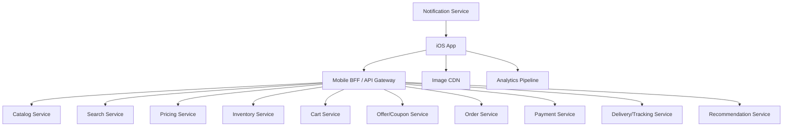

# Day 38: Design Amazon For iOS

This is a senior iOS architect-style answer for designing an Amazon-like iOS app. The focus is a large e-commerce app with catalog, search, product details, cart, checkout, payments, orders, recommendations, and operational safety.

## 1. Clarify Requirements

Core flows:

- Browse home page.
- Search products.
- Filter and sort results.
- View product details.
- Add to cart.
- Save to wishlist.
- Apply coupons/offers.
- Checkout.
- Pay securely.
- Track order.
- Cancel/return/refund.
- Receive order and offer notifications.

Non-functional:

- Accurate pricing and availability.
- Fast product search.
- Smooth product-list scrolling.
- Reliable checkout.
- Idempotent order creation.
- Secure payment.
- Good degraded behavior on poor network.
- Analytics for funnel drop-off.

## 2. High-Level Design



## 3. iOS Modules

```text
AppShell
AuthSession
HomeFeature
SearchFeature
ProductListFeature
ProductDetailsFeature
CartFeature
CheckoutFeature
PaymentFeature
OrdersFeature
WishlistFeature
NotificationsFeature
ImageLoader
AnalyticsCore
FeatureFlags
DeepLinkRouter
```

## 4. Product List

Requirements:

- Cursor pagination.
- Filters.
- Sort.
- Sponsored products if in scope.
- Image prefetching.
- Stable row identity.
- Preserve scroll position.

State:

```swift
enum ProductListState: Equatable {
    case loading
    case loaded(ProductListContent)
    case empty
    case failed(String)
}

struct ProductListContent: Equatable {
    var rows: [ProductRow]
    var filters: [FilterRow]
    var selectedSort: SortOption
    var nextCursor: String?
    var isRefreshing: Bool
    var isLoadingNextPage: Bool
}
```

## 5. Product Detail

Product details may show:

- Images/videos.
- Title.
- Price.
- Offers.
- Availability.
- Delivery estimate.
- Variants.
- Reviews.
- Questions.
- Recommendations.

Mobile BFF can compose this:

```http
GET /ios/products/{id}/details
```

Tradeoff:

- One BFF call improves latency and app simplicity.
- Separate price/inventory APIs improve freshness.
- Senior answer: use BFF for page structure, refresh price/inventory before cart/checkout.

## 6. Cart Design

Cart source of truth:

- Logged-in user: server.
- Guest user: local + merge on login.

Cart state:

```swift
enum CartState: Equatable {
    case loading
    case loaded(CartSummary)
    case empty
    case failed(String)
    case syncing(CartSummary)
}

struct CartSummary: Equatable {
    let items: [CartItemRow]
    let subtotal: String
    let discount: String?
    let total: String
    let unavailableItems: [String]
}
```

## 7. Checkout Design

Checkout requires stronger consistency than browsing.

Steps:

1. Validate cart.
2. Validate address.
3. Reprice items.
4. Apply offers.
5. Choose payment.
6. Create payment intent.
7. Place order with idempotency key.
8. Show confirmation.

State:

```swift
enum CheckoutState: Equatable {
    case reviewing(CheckoutSummary)
    case validating
    case paymentRequired(PaymentContext)
    case placingOrder
    case success(orderID: String)
    case failed(message: String, retryable: Bool)
}
```

## 8. Idempotency

Order placement must be idempotent.

```swift
struct PlaceOrderRequest: Encodable {
    let cartID: String
    let addressID: String
    let paymentTokenID: String
    let idempotencyKey: String
}
```

Why:

- User double taps.
- Network timeout.
- App killed after request.
- Retry after uncertain server result.

## 9. Payment

Rules:

- Do not store raw card details.
- Use tokenization/payment SDK.
- Handle 3DS/authentication flows.
- Handle callback/deep link.
- Treat uncertain result carefully.

Payment uncertainty:

```text
Payment request timed out.
Do not immediately create duplicate payment.
Check order/payment status using idempotency key or payment intent ID.
```

## 10. Order Tracking

Order status updates:

- App refresh.
- Push notification.
- Polling while tracking screen is open.

State:

```swift
enum OrderStatus {
    case placed
    case packed
    case shipped
    case outForDelivery
    case delivered
    case cancelled
    case returnRequested
}
```

## 11. Cache Strategy

Cache:

- Product images.
- Recently viewed products.
- Search suggestions.
- Home page sections.
- Product metadata with TTL.

Do not blindly cache:

- Final price.
- Payment state.
- Inventory state.

Refresh before checkout.

## 12. Analytics

Funnel:

- Search submitted.
- Product impression.
- Product opened.
- Add to cart.
- Cart viewed.
- Checkout started.
- Payment started.
- Payment failed.
- Order placed.

Senior note: analytics should include experiment IDs and request IDs where useful.

## 13. Tradeoffs

| Area | Tradeoff | Recommendation |
|---|---|---|
| Product details | One BFF call vs many APIs | BFF for display, fresh validation before cart/checkout |
| Cart | Local first vs server first | Server source for logged-in users |
| Checkout retry | Automatic retry vs user-controlled | Retry safe reads; use idempotency for writes |
| Price cache | Fast UI vs correctness | Cache display only; validate before purchase |
| Guest cart | Local only vs account merge | Local guest cart, merge on login with conflict UI |

## 14. Strong Interview Answer

```text
I would split browsing and checkout by consistency requirements. Product browsing can be cached and cursor-paginated, but cart, price, inventory, payment, and order placement need server validation. The iOS app uses feature modules for search, product list, details, cart, checkout, payment, and orders. Checkout is state-driven and uses idempotency keys to avoid duplicate orders. Payment uses tokenization, not raw card storage. Product details can be composed by a mobile BFF, but price/inventory should be refreshed before purchase.
```

## 15. Senior Architect Artifact Walkthrough

For an Amazon-like app, the most important architect skill is separating **browse consistency** from **purchase correctness**. Browsing can tolerate stale data. Checkout cannot.

### Artifact 1: Domain Boundary Map

What I would draw:

```text
Catalog: product identity and description
Search: query and ranking
Pricing: current price and discounts
Inventory: stock and delivery availability
Cart: selected items and quantities
Checkout: validation and order intent
Payment: tokenized payment flow
Order: order lifecycle
Delivery: tracking and fulfillment
```

My thinking:

```text
Product details look like one screen, but they pull from many domains. I would avoid making the iOS app orchestrate too many services directly. A mobile BFF can compose display data, while critical fields are revalidated before purchase.
```

### Artifact 2: Consistency Classification

| Data | Consistency Requirement | iOS Strategy |
|---|---|---|
| Product title/images | eventual | cache/CDN |
| Rating/reviews | eventual | cache with refresh |
| Price | strong before purchase | refresh before cart/checkout |
| Inventory | strong before purchase | validate before checkout |
| Cart | server source for logged-in | sync local interactions |
| Payment | strong | tokenization + idempotency |

My thinking:

```text
This table is usually the difference between a junior and senior answer. Not all data has the same correctness requirement.
```

### Artifact 3: Checkout State Machine

```swift
enum CheckoutState {
    case reviewing(CheckoutSummary)
    case validatingCart
    case validationFailed([CheckoutIssue])
    case paymentRequired(PaymentContext)
    case paymentProcessing
    case placingOrder
    case orderPlaced(OrderConfirmation)
    case uncertain(referenceID: String)
    case failed(message: String, retryable: Bool)
}
```

My thinking:

```text
Checkout must include an uncertain state. If payment succeeds but confirmation response times out, showing generic failure can cause duplicate orders or panic.
```

### Artifact 4: Idempotency Design

What I would define:

- Generate idempotency key per checkout attempt.
- Store it locally until order resolved.
- Retry status lookup with same key.
- Never create a new key for the same uncertain attempt.

Example:

```swift
struct CheckoutAttempt: Codable {
    let idempotencyKey: String
    let cartID: String
    let createdAt: Date
    var status: CheckoutAttemptStatus
}
```

My thinking:

```text
In commerce, network ambiguity is normal. Idempotency protects both user trust and backend correctness.
```

### Artifact 5: Cart Merge Decision Record

Scenario:

- Guest cart has items.
- User logs in.
- Server cart has existing items.

Decision options:

- Replace server cart.
- Replace guest cart.
- Merge items.
- Ask user when conflict exists.

My recommendation:

```text
Merge by product variant/customization where safe, show conflict if unavailable or price changed, and let server be final source after login.
```

### Artifact 6: API Contract For Product Details

```json
{
  "productID": "p_123",
  "title": "Wireless Keyboard",
  "media": [],
  "displayPrice": "USD 129.00",
  "availabilitySummary": "In stock",
  "deliveryEstimate": "Tomorrow",
  "sections": [
    { "type": "reviewsSummary" },
    { "type": "recommendations" }
  ],
  "freshness": {
    "priceTTLSeconds": 60,
    "inventoryTTLSeconds": 30
  }
}
```

My thinking:

```text
I like making freshness explicit. It tells the client which fields can be trusted briefly and which must be revalidated.
```

### Artifact 7: Funnel Analytics Plan

Events:

- search submitted
- product impression
- product opened
- add to cart
- cart updated
- checkout started
- validation failed
- payment started
- payment failed
- order placed

My thinking:

```text
For commerce, analytics is not optional. Without funnel analytics, product and engineering teams cannot diagnose where revenue-impacting failures occur.
```

## 16. Common Mistakes

- Treating price/inventory as static.
- No idempotency for order creation.
- Storing card details locally.
- No guest cart merge plan.
- No payment uncertainty handling.
- No funnel analytics.
- Product DTOs used directly in UI.
- No deep link strategy for order notifications.
