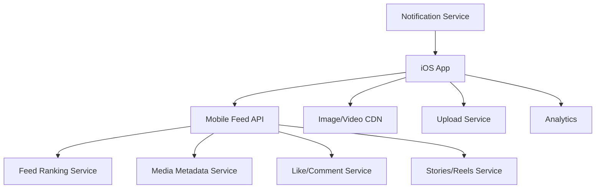

# Day 38: Design Instagram Feed For iOS

This is a senior iOS architect-style answer for designing an Instagram-like feed on iOS. The focus is feed ranking consumption, media loading, stories/reels basics, interactions, pagination, caching, analytics, and smooth UI.

## 1. Clarify Requirements

Core flow:

- User opens home feed.
- User scrolls posts.
- User sees image/video posts.
- User likes, comments, saves, shares.
- User watches stories/reels if included.
- Feed paginates.
- Pull to refresh.
- App tracks impressions.

Non-functional:

- Fast first render.
- Smooth scrolling.
- Correct media reuse.
- Low memory.
- Offline cached last feed.
- Stable analytics.
- Good behavior on poor network.

## 2. High-Level Design



## 3. iOS Modules

```text
FeedFeature
PostCellModule
MediaLoader
VideoAutoplayManager
StoriesFeature
CommentsFeature
PostComposerFeature
ProfileFeature
AnalyticsCore
ImageCache
DeepLinkRouter
```

## 4. Feed State

```swift
enum InstagramFeedState: Equatable {
    case loading
    case loaded(InstagramFeedContent)
    case empty
    case failed(String)
}

struct InstagramFeedContent: Equatable {
    var posts: [PostRow]
    var nextCursor: String?
    var isRefreshing: Bool
    var isLoadingNextPage: Bool
    var paginationError: String?
}
```

## 5. Post Row Model

```swift
struct PostRow: Identifiable, Hashable {
    let id: String
    let author: AuthorRow
    let media: [MediaRow]
    let caption: String
    let likeCountText: String
    let commentCountText: String
    let isLiked: Bool
    let isSaved: Bool
}

enum MediaRow: Hashable {
    case image(url: URL, aspectRatio: Double)
    case video(url: URL, thumbnailURL: URL, aspectRatio: Double, duration: TimeInterval)
}
```

Senior note: feed cells should receive display-ready rows, not raw API objects.

## 6. Media Loading

Media rules:

- Load thumbnails quickly.
- Downsample images.
- Cancel requests during reuse.
- Prefetch upcoming media.
- Use memory + disk cache.
- Avoid loading full-resolution media in feed cells.

Cell reuse protection:

```swift
final class PostImageCell: UICollectionViewCell {
    private var representedMediaID: String?

    func configure(mediaID: String, url: URL, loader: ImageLoading) {
        representedMediaID = mediaID
        imageView.image = placeholder

        loader.load(url) { [weak self] image in
            guard self?.representedMediaID == mediaID else { return }
            self?.imageView.image = image
        }
    }
}
```

## 7. Video Autoplay

Autoplay rules:

- Autoplay only visible focused video.
- Mute by default depending on product decision.
- Pause when app backgrounds.
- Pause when cell leaves viewport.
- Avoid multiple players active.
- Respect low power/data saver settings.

Tradeoff:

- Autoplay increases engagement.
- It can increase battery/network usage.

## 8. Like/Save Optimistic Update

Optimistic like:

```swift
enum LikeSyncState {
    case synced
    case pending
    case failed
}
```

Flow:

1. User taps like.
2. Update UI immediately.
3. Send request.
4. If success, mark synced.
5. If failure, rollback or show retry.

Senior discussion:

- Likes can be optimistic because they are low risk.
- Payments/orders should not use casual optimistic behavior.

## 9. Comments

Comments may be:

- Preview count in feed.
- Full comments screen.
- Paginated replies.
- Optimistic posting.
- Moderation states.

Design comments as separate module to avoid bloated feed screen.

## 10. Impression Tracking

Do not track impression when cell is created. Track when:

- Post is visible.
- Visibility crosses threshold.
- It remains visible for minimum duration.

Event:

```swift
struct FeedImpressionEvent {
    let postID: String
    let position: Int
    let feedSessionID: String
    let visibleDuration: TimeInterval
}
```

## 11. Cache And Offline

Cache:

- Last feed response.
- Media thumbnails.
- Recently viewed posts.
- Pending like/save actions if offline support exists.

Do not assume feed cache is fresh. Show cached feed and refresh.

## 12. Pagination

Use cursor pagination:

```http
GET /feed/home?cursor=abc&pageSize=20
```

Client must:

- Avoid duplicate requests.
- Deduplicate post IDs.
- Keep existing content if pagination fails.
- Preserve scroll position during refresh.

## 13. Tradeoffs

| Area | Tradeoff | Recommendation |
|---|---|---|
| Feed ranking | Client ranking vs server ranking | Server ranks; iOS renders and tracks |
| Media | High quality vs speed | Use CDN variants and progressive loading |
| Likes | Optimistic vs confirmed | Optimistic with rollback |
| Autoplay | Engagement vs battery | Autoplay focused visible video only |
| Feed cache | Freshness vs speed | Cache last feed, refresh in background |

## 14. Strong Interview Answer

```text
I would design the feed around stable post IDs, cursor pagination, display-ready row models, image/video caching, and diffable updates. Media loading must be cancellable because cells are reused. Video autoplay should be limited to the focused visible cell to protect battery and performance. Likes can use optimistic UI with rollback, while comments are a separate module. Impressions should be based on actual visibility, not cell creation.
```

## 15. Senior Architect Artifact Walkthrough

For an Instagram-like feed, I would focus on scroll performance, media correctness, stable identity, and analytics quality. Feed design looks simple until you handle reuse, media, ranking, pagination, and impressions correctly.

### Artifact 1: Feed Rendering Contract

What I would define:

```text
Input: ordered feed page from server
Output: stable section/item row models for collection view
Identity: post ID, media ID, author ID
Rendering: diffable snapshot or equivalent state-driven update
```

My thinking:

```text
The app should not rank the main feed locally. The backend ranks; iOS preserves order, deduplicates defensively, renders efficiently, and reports impressions accurately.
```

### Artifact 2: Cell Reuse Safety Checklist

Every feed cell must:

- Reset previous media.
- Cancel old image/video requests.
- Store represented post/media ID.
- Avoid owning navigation.
- Avoid starting analytics just because it was configured.

My thinking:

```text
Most feed bugs are reuse bugs. If the user scrolls quickly and sees the wrong image, that is often because async media completion updated a reused cell.
```

### Artifact 3: Media Loading Pipeline

```text
Request thumbnail -> memory cache -> disk cache -> CDN -> downsample -> decode -> render if cell still represents same media
```

My thinking:

```text
Media loading must be cancellation-aware and size-aware. Loading a full-resolution image for a small feed cell is a performance bug.
```

### Artifact 4: Autoplay Policy

Policy I would define:

- Autoplay only one video at a time.
- Prefer most visible video.
- Pause when app backgrounds.
- Respect low power mode if product agrees.
- Do not autoplay on poor network if data saver enabled.

My thinking:

```text
Autoplay is a product and systems tradeoff. It increases engagement, but costs battery, data, and implementation complexity.
```

### Artifact 5: Impression Tracking Spec

Event should include:

```swift
struct PostImpression {
    let postID: String
    let feedSessionID: String
    let position: Int
    let visiblePercentage: Double
    let visibleDuration: TimeInterval
    let experimentIDs: [String]
}
```

My thinking:

```text
Impressions should be visibility-based. Cell creation is not an impression because prefetching and reuse can create cells the user never truly saw.
```

### Artifact 6: Optimistic Interaction Policy

Actions:

- Like: optimistic.
- Save: optimistic with retry.
- Comment post: pending state.
- Delete post: confirm and server-authoritative.

My thinking:

```text
Not every interaction deserves the same consistency model. Low-risk social actions can be optimistic. Destructive actions need more care.
```

### Artifact 7: Feed Failure Matrix

| Failure | UX |
|---|---|
| Initial load fails | full-screen retry |
| Pagination fails | footer retry, keep posts |
| Refresh fails | keep feed, show non-blocking error |
| Image fails | placeholder + retry |
| Like fails | rollback or failed state |

My thinking:

```text
A single generic error state is not enough for a feed. The UX depends on whether content already exists.
```

## 16. Common Mistakes

- Tracking impressions in `cellForItem`.
- Loading full-size images in feed cells.
- No cell reuse protection.
- Multiple videos playing at once.
- No pagination failure state.
- No stable identity.
- Treating feed cache as source of truth.
