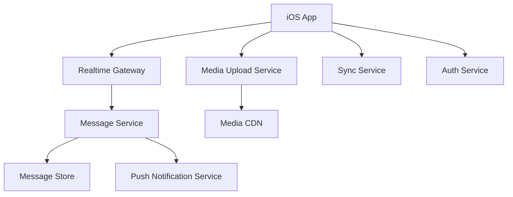

# Day 38: Design WhatsApp Chat For iOS

This is a senior iOS architect-style answer for designing a WhatsApp-like chat app on iOS. The focus is realtime messaging, offline queue, delivery states, media, notifications, local database, sync, encryption considerations, and app lifecycle.

## 1. Clarify Requirements

Core flows:

- View conversation list.
- Open chat.
- Send text message.
- Send image/video/audio/document.
- Receive messages in realtime.
- Show delivery/read states.
- Search chats.
- Receive push notifications.
- Work with poor network.
- Support offline send queue.

Non-functional:

- Low message latency.
- Reliable delivery.
- Local persistence.
- Duplicate prevention.
- Secure message storage.
- End-to-end encryption if required.
- Efficient media upload/download.

## 2. High-Level Design



## 3. iOS Modules

```text
ConversationListFeature
ChatRoomFeature
MessageComposer
MessageStore
RealtimeConnection
OfflineOutbox
MediaUploader
MediaDownloader
NotificationRouter
EncryptionCore
ContactSync
SearchIndex
```

## 4. Local Database As UI Source

For chat, UI should usually render from local database.

Flow:

```text
Realtime message -> Save to local DB -> UI observes DB/state -> Render
```

Why:

- Chat history loads fast.
- Offline works.
- App restarts preserve messages.
- Sync can reconcile later.

## 5. Message Model

```swift
struct Message: Identifiable, Equatable {
    let id: String
    let conversationID: String
    let senderID: String
    let createdAt: Date
    var body: MessageBody
    var deliveryState: MessageDeliveryState
}

enum MessageBody: Equatable {
    case text(String)
    case image(localURL: URL?, remoteURL: URL?)
    case video(localURL: URL?, remoteURL: URL?)
    case audio(localURL: URL?, remoteURL: URL?)
}

enum MessageDeliveryState: Equatable {
    case queued
    case sending
    case sent
    case delivered
    case read
    case failed
}
```

## 6. Send Message Flow

1. User sends message.
2. App creates local message with client-generated ID.
3. Save message as queued/sending.
4. Send through realtime connection or API.
5. Server acknowledges with server timestamp.
6. Update delivery state.
7. Retry if network fails.

Client-generated ID prevents duplicate UI messages.

## 7. Offline Outbox

```swift
struct OutboxItem: Identifiable, Codable {
    let id: String
    let conversationID: String
    let payload: Data
    var attemptCount: Int
    let createdAt: Date
}
```

Outbox rules:

- Persist pending messages.
- Retry when network returns.
- Preserve order per conversation.
- Limit attempts.
- Show failed state.

## 8. Realtime Transport

Options:

- WebSocket for active realtime messaging.
- Push notifications when inactive.
- Sync API for missed messages.

App lifecycle:

- Foreground: WebSocket active.
- Background: limited execution, rely on push/sync.
- Relaunch: sync missing messages.

## 9. Deduplication

Messages may arrive from:

- WebSocket.
- Push.
- Sync API.
- Retry acknowledgement.

Deduplicate by stable message ID.

```swift
func mergeMessages(existing: [Message], incoming: [Message]) -> [Message] {
    var byID = Dictionary(uniqueKeysWithValues: existing.map { ($0.id, $0) })

    for message in incoming {
        byID[message.id] = message
    }

    return byID.values.sorted { $0.createdAt < $1.createdAt }
}
```

## 10. Media Upload

Flow:

1. User selects media.
2. App compresses if needed.
3. Create local message with local preview.
4. Upload media.
5. Send message with remote media reference.
6. Update state.

Tradeoff:

- Send text metadata after upload: simpler, but slower visible send.
- Create pending message first: better UX, more state complexity.

## 11. Encryption

If end-to-end encryption is required:

- Encrypt message before sending.
- Server stores encrypted payload.
- Keys stored securely.
- Push payload should not expose sensitive content.

Senior note: do not hand-wave encryption. If scope includes E2EE, mention key management as a major subsystem.

## 12. Push Notifications

Push payload should be privacy-aware.

Options:

- Generic: "New message"
- Sender + preview if user allows.
- Silent push to trigger sync when possible.

Do not rely on silent push for correctness.

## 13. Tradeoffs

| Area | Tradeoff | Recommendation |
|---|---|---|
| UI source | Remote only vs local DB | Local DB as UI source |
| Message ID | Server-only vs client-generated | Client-generated + server ack |
| Realtime | WebSocket vs polling | WebSocket foreground, push/sync background |
| Media send | Upload first vs pending local message | Pending local message for better UX |
| Encryption | Simpler server-readable vs E2EE | Depends on product/security requirement |

## 14. Strong Interview Answer

```text
For chat, I would make the local message store the UI source of truth. Sending creates a local message with client ID and queued/sending state, then the app sends through WebSocket or API. Server ack updates delivery state. Incoming messages from WebSocket, push, or sync are deduplicated by message ID. Background correctness relies on push plus sync, not always-on sockets. Media uploads use pending local previews and update after upload. If E2EE is required, encryption and key management become core design constraints.
```

## 15. Senior Architect Artifact Walkthrough

For a WhatsApp-like app, I would center the design around local-first message storage, delivery state, deduplication, and lifecycle-aware realtime communication.

### Artifact 1: Message Lifecycle State Machine

```swift
enum MessageLifecycle {
    case drafted
    case queued
    case sending
    case sent(serverID: String)
    case delivered
    case read
    case failed(retryable: Bool)
}
```

My thinking:

```text
Messaging is state-heavy. A message can exist before the server knows about it. That is why client-generated IDs and local pending state are important.
```

### Artifact 2: Local Store As Source Of Truth

Design:

```text
Network events do not directly mutate visible cells.
Network events update local store.
UI observes/query local store.
```

My thinking:

```text
This gives fast launch, offline history, consistent sync, and easier deduplication. Chat apps should not depend on fetching everything from network every time.
```

### Artifact 3: Realtime Lifecycle Plan

| App State | Strategy |
|---|---|
| Foreground chat open | WebSocket active |
| Foreground not in chat | WebSocket or lightweight sync |
| Background | push + background-safe sync when possible |
| Relaunch | fetch missed messages |

My thinking:

```text
The biggest mistake is assuming sockets stay alive forever on iOS. iOS lifecycle rules shape the architecture.
```

### Artifact 4: Deduplication Contract

Identifiers:

- `clientMessageID`
- `serverMessageID`
- `conversationID`
- `createdAt`

My thinking:

```text
The same message can arrive through send ack, WebSocket, push-triggered sync, or history sync. Without a dedupe contract, users see duplicate messages.
```

### Artifact 5: Outbox Design

Outbox item:

```swift
struct OutboxMessage: Codable, Identifiable {
    let id: String
    let conversationID: String
    let encryptedPayload: Data
    let createdAt: Date
    var attemptCount: Int
}
```

My thinking:

```text
Offline send is not a boolean. It is a durable queue with ordering, retry, failure, and user-visible state.
```

### Artifact 6: Media Message Pipeline

```text
Pick media -> create local preview message -> compress/encrypt -> upload -> send message metadata -> ack -> update local store
```

My thinking:

```text
The user should see the message immediately, but the system must represent that upload/send is still pending.
```

### Artifact 7: Privacy And Encryption Artifact

If E2EE is in scope, I would explicitly document:

- Message payload encrypted before network.
- Server cannot read message body.
- Push previews may be generic.
- Key backup/recovery is separate design.
- Local database protection strategy.

My thinking:

```text
Encryption is not a single checkbox. It affects push, search, backup, multi-device sync, and media.
```

## 16. Common Mistakes

- UI depends only on network response.
- No offline outbox.
- No deduplication.
- No delivery states.
- Assuming WebSocket works in background forever.
- Sensitive message preview in push without privacy controls.
- No media upload state.
- No local persistence.
