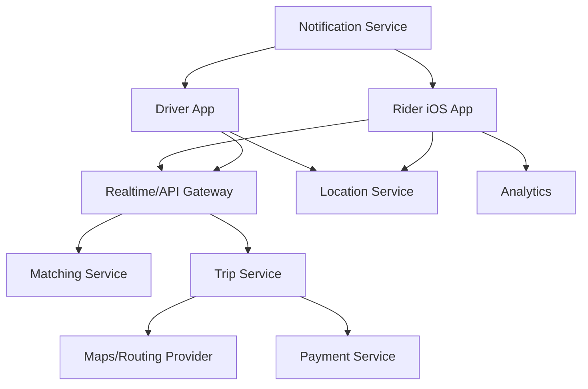

# Day 38: Design Uber Ride Tracking For iOS

This is a senior iOS architect-style answer for designing Uber-like ride tracking on iOS. The focus is location, maps, realtime updates, state machines, ETA, driver/rider communication, battery, privacy, and reliability.

## 1. Clarify Requirements

Core flows:

- User requests ride.
- App shows nearby drivers if in scope.
- User selects pickup/drop.
- Backend matches driver.
- App tracks driver to pickup.
- App tracks trip progress.
- User can call/message driver.
- User sees ETA and route.
- User receives ride status notifications.
- Trip completes and user pays/rates.

Non-functional:

- Accurate-enough location.
- Low latency updates.
- Battery-aware tracking.
- Privacy-safe location handling.
- Resilient to poor network.
- Correct state transitions.

## 2. High-Level Design



## 3. iOS Modules

```text
RideRequestFeature
RideTrackingFeature
MapFeature
LocationManager
RealtimeTripClient
TripRepository
ETAService
PaymentFeature
DriverContactFeature
NotificationRouter
AnalyticsCore
```

## 4. Ride State Machine

```swift
enum RideState: Equatable {
    case idle
    case selectingPickup
    case selectingDropoff
    case estimatingFare
    case requesting
    case matching
    case driverAssigned(DriverInfo)
    case driverArriving(TripTracking)
    case driverArrived(TripTracking)
    case inProgress(TripTracking)
    case completed(Receipt)
    case cancelled(reason: String)
    case failed(message: String)
}
```

Senior point: ride tracking must be a state machine. Random booleans will create invalid states.

## 5. Location Updates

Location sources:

- Rider GPS.
- Driver GPS.
- Backend trip updates.
- Map routing provider.

iOS concerns:

- Ask permission at right time.
- Use appropriate accuracy.
- Reduce updates when not needed.
- Stop updates after ride ends.
- Handle denied permission.

## 6. Realtime Updates

Options:

- WebSocket.
- Polling fallback.
- Push notification for background.

Recommended:

- WebSocket while tracking screen is active.
- Polling fallback if socket fails.
- Push notifications for major status changes.

## 7. Driver Location Rendering

Do not jump marker abruptly. Smooth it.

```swift
struct DriverLocationUpdate: Equatable {
    let coordinate: Coordinate
    let bearing: Double?
    let updatedAt: Date
}
```

Client behavior:

- Ignore very stale updates.
- Interpolate marker movement.
- Avoid over-rendering map.
- Update route/ETA at controlled frequency.

## 8. ETA Design

ETA can come from:

- Backend.
- Maps provider.
- Client estimate.

Senior recommendation:

- Backend should provide authoritative ETA because it can combine traffic, driver state, route, and marketplace data.
- Client can display and refresh it.

## 9. Communication

Driver contact:

- Masked phone call.
- In-app chat.
- Predefined quick messages.

Privacy:

- Do not expose real phone numbers.
- Avoid storing unnecessary location history.

## 10. Background Behavior

Rider app:

- May not need continuous background tracking.
- Push can update major ride state.
- Refresh when app opens.

Driver app:

- Requires more continuous location handling.
- Has stricter battery and permission design.

## 11. Failure Modes

- Location permission denied.
- GPS inaccurate.
- Network lost.
- Driver cancels.
- Rider cancels.
- Payment fails.
- Backend update delayed.
- App killed mid-trip.

Good UX:

- Show last known driver location with timestamp.
- Retry connection.
- Use push for state changes.
- Keep trip ID and recover on relaunch.

## 12. Tradeoffs

| Area | Tradeoff | Recommendation |
|---|---|---|
| Realtime | WebSocket vs polling | WebSocket active, polling fallback |
| Location accuracy | High accuracy vs battery | Use high only during active tracking |
| ETA | Client vs backend | Backend authoritative |
| Marker updates | Every update vs smoothed/throttled | Smooth and throttle |
| Background | Continuous vs event-based | Rider event-based; driver more continuous |

## 13. Strong Interview Answer

```text
I would model ride tracking as a strict state machine from request to matching, driver assigned, arriving, arrived, in progress, completed, or cancelled. The app uses realtime updates while active, push for background state changes, and polling fallback. Driver location updates are smoothed and stale updates ignored. ETA should come from backend/maps service. Location accuracy is adjusted to balance battery and experience, and the app must recover trip state after relaunch using trip ID.
```

## 14. Senior Architect Artifact Walkthrough

For Uber-like ride tracking, I would focus on state correctness, realtime reliability, location privacy, and battery-aware map rendering.

### Artifact 1: Trip State Machine

What I would produce:

```swift
enum TripState {
    case draft(PickupDropoffDraft)
    case fareEstimating
    case requesting
    case matching
    case assigned(DriverInfo)
    case driverEnRoute(TrackingSnapshot)
    case driverArrived(TrackingSnapshot)
    case inTrip(TrackingSnapshot)
    case completed(Receipt)
    case cancelled(CancelReason)
    case failed(String)
}
```

My thinking:

```text
Ride apps cannot be designed with loose booleans. The user, driver, payment, and map all depend on a valid trip state.
```

### Artifact 2: Realtime Strategy

I would define:

- WebSocket while active.
- Polling fallback.
- Push for major background transitions.
- Recover trip state on launch.

My thinking:

```text
Realtime is not one transport. It is a reliability strategy. The app should degrade gracefully if sockets fail.
```

### Artifact 3: Location Accuracy Policy

| Phase | Accuracy | Reason |
|---|---|---|
| Selecting pickup | balanced | enough for pickup UX |
| Active tracking | higher | map/ETA needs precision |
| Ride completed | off | battery/privacy |
| Background rider app | limited/event-based | iOS limits + battery |

My thinking:

```text
Always-on high accuracy is bad architecture. Location should match product need and lifecycle phase.
```

### Artifact 4: Map Rendering Policy

Rules:

- Ignore stale driver updates.
- Smooth marker movement.
- Throttle route redraws.
- Show last updated time.
- Avoid blocking main thread.

My thinking:

```text
Map jank is easy to create. Driver may send frequent updates, but the UI should render at a controlled cadence.
```

### Artifact 5: ETA Ownership Decision

Decision:

```text
Backend/maps service owns ETA.
iOS displays ETA and refreshes.
Client can interpolate UI but should not be authoritative.
```

My thinking:

```text
ETA depends on traffic, routing, marketplace, and driver state. The client has limited context.
```

### Artifact 6: Relaunch Recovery Flow

```text
App launch -> find active trip ID -> fetch latest trip snapshot -> reconnect realtime -> render state
```

My thinking:

```text
Mobile apps are killed. A serious design always includes recovery after relaunch.
```

## 15. Common Mistakes

- No ride state machine.
- Treating location as always accurate.
- Updating map too frequently.
- Assuming socket always stays connected.
- No recovery after app relaunch.
- No location permission fallback.
- No privacy discussion.
- Same design for rider and driver app.
