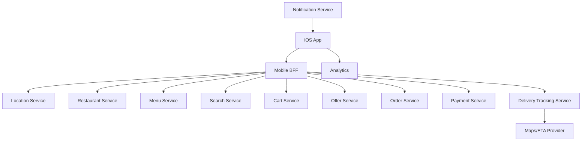

# Day 38: Design Swiggy Food Delivery For iOS

This is a senior iOS architect-style answer for designing a Swiggy-like food delivery app on iOS. The focus is restaurant discovery, menu, cart, checkout, payment, order tracking, delivery partner location, offers, and reliability.

## 1. Clarify Requirements

Core flows:

- Detect/select location.
- Browse restaurants.
- Search dishes/restaurants.
- View restaurant menu.
- Add items to cart.
- Customize items.
- Apply coupons.
- Checkout and pay.
- Track order preparation and delivery.
- Contact delivery partner.
- Rate order.

Non-functional:

- Accurate location.
- Fast menu loading.
- Correct price/taxes/fees.
- Reliable checkout.
- Realtime order tracking.
- Push notifications.
- Good behavior under poor network.

## 2. High-Level Design



## 3. iOS Modules

```text
LocationSelectionFeature
RestaurantListFeature
RestaurantDetailsFeature
MenuFeature
CartFeature
CheckoutFeature
PaymentFeature
OrderTrackingFeature
DeliveryPartnerFeature
SearchFeature
OffersFeature
NotificationRouter
AnalyticsCore
```

## 4. Restaurant List

Key data:

- Restaurant ID.
- Name.
- Cuisine.
- Rating.
- Delivery time.
- Distance.
- Offer.
- Availability.

State:

```swift
enum RestaurantListState {
    case requestingLocation
    case loading
    case loaded(RestaurantListContent)
    case empty
    case failed(String)
    case locationDenied
}
```

## 5. Menu Design

Menus can change frequently:

- Item availability.
- Price.
- Customizations.
- Offers.
- Restaurant open/closed.

Menu item:

```swift
struct MenuItem: Identifiable, Equatable {
    let id: String
    let name: String
    let price: Decimal
    let isAvailable: Bool
    let customizationGroups: [CustomizationGroup]
}
```

Senior note: validate cart before checkout because menu data may be stale.

## 6. Cart Design

Food cart constraints:

- Usually one restaurant per cart.
- Item customizations matter.
- Delivery fee/taxes can change.
- Coupon validity can change.

Cart item identity should include item + customization:

```swift
struct FoodCartItem: Identifiable, Equatable {
    let id: String
    let menuItemID: String
    let customizationSignature: String
    var quantity: Int
}
```

## 7. Checkout Flow

Steps:

1. Validate restaurant availability.
2. Validate item availability.
3. Recalculate price, taxes, delivery fee.
4. Validate coupon.
5. Select address.
6. Select payment.
7. Place order with idempotency key.

State:

```swift
enum FoodCheckoutState {
    case reviewing(CartSummary)
    case validating
    case paymentRequired(PaymentContext)
    case placingOrder
    case orderPlaced(orderID: String)
    case failed(message: String, retryable: Bool)
}
```

## 8. Order Tracking

Order states:

```swift
enum FoodOrderStatus {
    case placed
    case restaurantAccepted
    case preparing
    case pickedUp
    case arriving
    case delivered
    case cancelled
}
```

Tracking sources:

- Order service.
- Delivery tracking service.
- Push notifications.
- Polling/realtime.

## 9. Delivery Location

During active tracking:

- Use realtime or polling.
- Smooth marker updates.
- Ignore stale updates.
- Show last updated time.
- Refresh ETA at reasonable intervals.

## 10. Location Permission

If location denied:

- Allow manual location selection.
- Explain why location improves discovery.
- Do not block entire app unnecessarily.

## 11. Failure Modes

- Restaurant closes after cart creation.
- Item unavailable.
- Coupon expired.
- Payment fails.
- Order placed but confirmation delayed.
- Delivery tracking delayed.
- Location inaccurate.

Good UX:

- Show actionable errors.
- Preserve cart where possible.
- Revalidate before payment.
- Check order status after payment uncertainty.

## 12. Tradeoffs

| Area | Tradeoff | Recommendation |
|---|---|---|
| Restaurant list | Real-time availability vs cache | Cache list briefly, refresh availability |
| Cart | Local speed vs server correctness | Local cart for UX, server validation before checkout |
| Tracking | WebSocket vs polling | Realtime active, push/poll fallback |
| Location | GPS auto vs manual | Support both |
| Coupon | Apply locally vs server | Server authoritative |

## 13. Strong Interview Answer

```text
I would split the app into location, restaurant list, menu, cart, checkout, payment, and order tracking modules. Restaurant/menu browsing can use cache with short TTL, but checkout must revalidate availability, price, taxes, fees, and coupons. Order placement uses idempotency. Tracking uses realtime or polling while active, push notifications in background, and map marker smoothing. Location denial should fall back to manual selection.
```

## 14. Senior Architect Artifact Walkthrough

For a Swiggy-like app, I would emphasize location, availability, cart correctness, checkout validation, and live order tracking.

### Artifact 1: Location Decision Flow

```text
Has precise location permission? Use current location.
Permission denied? Ask for manual address.
Address selected? Fetch serviceable restaurants.
No service? Show unavailable area state.
```

My thinking:

```text
Food delivery starts with location, but the app should not become unusable if permission is denied. Manual location is a required fallback.
```

### Artifact 2: Restaurant Availability Model

```swift
enum RestaurantAvailability {
    case open
    case closed(reason: String)
    case notServiceable
    case busy(estimatedDelay: String)
}
```

My thinking:

```text
Open/closed is too simple. Restaurants can be busy, temporarily unavailable, or outside delivery range.
```

### Artifact 3: Menu And Customization Contract

Important fields:

- item ID
- price
- availability
- customization groups
- required choices
- max/min selections

My thinking:

```text
Cart identity must include customizations. Two burgers with different add-ons are not the same cart line item.
```

### Artifact 4: Cart Validation Artifact

Before checkout, validate:

- restaurant still open
- items available
- customizations valid
- price changed
- delivery fee changed
- coupon valid
- address serviceable

My thinking:

```text
Browsing can be cached. Checkout must be server validated. Food delivery has too many changing variables to trust stale menu/cart data.
```

### Artifact 5: Order Tracking State Machine

```swift
enum OrderTrackingState {
    case placed
    case restaurantAccepted
    case preparing
    case deliveryAssigned(PartnerInfo)
    case pickedUp(TrackingSnapshot)
    case arriving(TrackingSnapshot)
    case delivered
    case cancelled(String)
}
```

My thinking:

```text
Tracking is not just map location. Kitchen state and delivery partner state both affect UX.
```

### Artifact 6: Payment Uncertainty Flow

```text
Payment timeout -> do not create new order immediately -> query payment/order status -> show pending if unresolved
```

My thinking:

```text
Food delivery payments have the same idempotency concern as e-commerce. Duplicate payment/order creation is a severe trust issue.
```

## 15. Common Mistakes

- No manual location fallback.
- Cart does not include customizations.
- No menu revalidation.
- No idempotency for order placement.
- Coupon calculated only on client.
- Tracking assumes realtime always works.
- No payment uncertainty handling.
