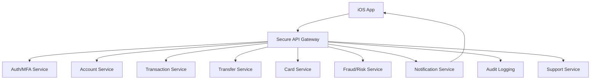

# Day 38: Design A Banking App For iOS

This is a senior iOS architect-style answer for designing a banking app on iOS. Banking apps are high-stakes systems. The design must prioritize security, correctness, privacy, auditability, reliability, accessibility, and regulatory expectations.

## 1. Clarify Requirements

Core flows:

- Login.
- Biometric unlock.
- View accounts.
- View transactions.
- Transfer money.
- Pay bills.
- Manage cards.
- Receive fraud/security alerts.
- Download statements.
- Contact support.

Non-functional:

- Strong security.
- Correct balances.
- No duplicate transfers.
- Audit trail.
- Privacy.
- Resilience to network failure.
- Accessibility.
- Device risk checks.
- Session timeout.

## 2. High-Level Design



## 3. iOS Modules

```text
AuthFeature
MFAFeature
BiometricUnlock
AccountDashboardFeature
TransactionHistoryFeature
TransferFeature
BillPayFeature
CardManagementFeature
SecurityAlertsFeature
SecureSessionManager
KeychainStore
AuditAnalytics
DeepLinkRouter
```

## 4. Security Design

Must include:

- ATS.
- Tokens in Keychain.
- Short-lived access token.
- Refresh token protection.
- Biometric unlock with LocalAuthentication.
- Session timeout.
- Device binding if required.
- Jailbreak/root detection as risk signal.
- No sensitive data in logs.
- Screenshot/app switcher privacy.
- Certificate pinning if justified by threat model.

## 5. Authentication Flow

```text
Open app -> Check secure session -> Biometric/passcode unlock -> Fetch accounts -> Show dashboard
```

Login may require:

- Password.
- OTP.
- Device registration.
- MFA.
- Risk-based challenge.

## 6. Session State

```swift
enum SecureSessionState {
    case loggedOut
    case authenticating
    case mfaRequired(MFAContext)
    case unlocked(UserSession)
    case locked
    case expired
}
```

Senior note: locked and logged out are different. Locked may have secure session material but requires local re-authentication.

## 7. Account Dashboard

Data:

- Account ID.
- Masked account number.
- Account type.
- Available balance.
- Current balance.
- Currency.

Do not cache sensitive balances without clear security policy.

## 8. Transaction History

Requirements:

- Paginated.
- Filterable.
- Searchable if allowed.
- Shows pending vs posted.
- Pull to refresh.
- Error states.

State:

```swift
enum TransactionListState {
    case loading
    case loaded(TransactionContent)
    case empty
    case failed(String)
}

struct TransactionContent {
    let rows: [TransactionRow]
    let nextCursor: String?
    let isLoadingNextPage: Bool
}
```

## 9. Money Transfer Flow

Transfer steps:

1. Select source account.
2. Select recipient.
3. Enter amount.
4. Validate limits.
5. Show review screen.
6. Require MFA if needed.
7. Submit transfer with idempotency key.
8. Show receipt/status.

Transfer state:

```swift
enum TransferState {
    case editing(TransferDraft)
    case validating
    case review(TransferReview)
    case mfaRequired(MFAContext)
    case submitting
    case success(TransferReceipt)
    case failed(message: String, retryable: Bool)
    case uncertain(referenceID: String)
}
```

## 10. Idempotency And Uncertain Results

Money movement must be idempotent.

```swift
struct TransferRequest: Encodable {
    let sourceAccountID: String
    let recipientID: String
    let amount: Decimal
    let currencyCode: String
    let idempotencyKey: String
}
```

If request times out:

- Do not blindly retry as new transfer.
- Query transfer status by idempotency key/reference.
- Show pending/uncertain state.

## 11. Local Storage

Store:

- Tokens in Keychain.
- Non-sensitive preferences in UserDefaults.
- Some cached UI metadata only if allowed.

Avoid storing:

- Full account numbers.
- Sensitive transaction details unless encrypted and required.
- Passwords.
- OTP.
- Card PAN/CVV.

## 12. Push Notifications

Types:

- Login alert.
- Transfer alert.
- Card transaction alert.
- Fraud alert.

Payload should avoid sensitive data:

```json
{
  "aps": {
    "alert": {
      "title": "Security alert",
      "body": "Review recent account activity."
    }
  },
  "route": "app://security/alerts/123"
}
```

## 13. Observability And Audit

Track:

- Login success/failure.
- MFA challenge.
- Transfer initiated.
- Transfer status.
- API latency.
- Security risk events.
- Crash/non-fatal errors.

Do not track sensitive values like full account number or amount unless policy explicitly allows and data is protected.

## 14. Tradeoffs

| Area | Tradeoff | Recommendation |
|---|---|---|
| Balance cache | Fast dashboard vs sensitive stale data | Minimal cache, refresh securely |
| Biometric | Convenience vs risk | Biometric unlock after secure login, fallback passcode/MFA |
| Transfer retry | Automatic retry vs duplicate risk | Idempotency + status lookup |
| Push content | Informative vs private | Generic notification body |
| Jailbreak detection | Block app vs risk score | Use as risk signal with policy |

## 15. Strong Interview Answer

```text
For a banking app, I would design security and correctness first. Tokens go in Keychain, sessions are short-lived, biometric unlock is separate from login, and sensitive screens lock after inactivity. Money movement uses review, MFA when needed, idempotency keys, and uncertain-result handling. Push payloads avoid sensitive data. Transaction history is paginated and secure. Observability and audit logs are critical, but logs must not contain secrets or sensitive account details.
```

## 16. Senior Architect Artifact Walkthrough

For a banking app, I would expect the most disciplined answer. Banking system design is not about fancy UI first. It is about security, correctness, auditability, and user trust.

### Artifact 1: Threat Model

Threats:

- stolen device
- compromised session
- token leakage
- insecure network
- sensitive data in logs
- screenshot/app switcher exposure
- duplicate transfer
- phishing/deep link abuse

My thinking:

```text
Before designing screens, I want to know what we are protecting. Banking apps require threat modeling as a first-class design artifact.
```

### Artifact 2: Secure Session State Machine

```swift
enum BankingSessionState {
    case loggedOut
    case authenticating
    case mfaRequired(MFAContext)
    case active(UserSession)
    case locked(UserSession)
    case expired
    case blocked(reason: String)
}
```

My thinking:

```text
Logged out, locked, expired, and blocked are different. Treating them as one state creates bad UX and security bugs.
```

### Artifact 3: Sensitive Data Storage Matrix

| Data | Storage |
|---|---|
| access token | memory if possible |
| refresh token | Keychain |
| username preference | UserDefaults if allowed |
| account balance | avoid or encrypted short-lived cache |
| full card/account number | do not store casually |
| statement PDF | protected file storage if required |

My thinking:

```text
I would explicitly separate convenience data from sensitive financial data. UserDefaults is not secure storage.
```

### Artifact 4: Transfer State Machine

```swift
enum TransferFlowState {
    case editing(TransferDraft)
    case validating
    case review(TransferReview)
    case mfaRequired(MFAContext)
    case submitting(idempotencyKey: String)
    case success(TransferReceipt)
    case uncertain(referenceID: String)
    case failed(message: String, retryable: Bool)
}
```

My thinking:

```text
The uncertain state is mandatory. A timeout after transfer submission cannot be treated like no transfer happened.
```

### Artifact 5: Audit And Observability Plan

Track:

- login attempt result
- MFA challenge
- session lock/unlock
- transfer initiated
- transfer submitted
- transfer uncertain
- transfer confirmed
- security setting changed

Do not log:

- passwords
- OTPs
- full account numbers
- full card numbers
- tokens

My thinking:

```text
Banking observability must support audit and incident response without leaking sensitive data.
```

### Artifact 6: Deep Link Safety Policy

Rules:

- Never execute money movement directly from deep link.
- Deep link may navigate to review screen.
- Require auth/session unlock.
- Require MFA for risky actions.
- Validate route parameters server-side.

My thinking:

```text
Deep links are useful but dangerous. A banking app should never let a URL bypass authentication or confirmation.
```

### Artifact 7: Release And Kill Switch Plan

For risky features:

- phased rollout
- server-side feature flag
- kill switch
- app version gating
- crash/failure dashboard
- rollback plan

My thinking:

```text
Mobile rollback is slow. For banking, every risky feature needs operational controls before release.
```

## 17. Common Mistakes

- Treating banking like normal e-commerce.
- Caching sensitive data casually.
- No session timeout.
- No MFA/risk challenge.
- Retrying transfers without idempotency.
- Sensitive push notification body.
- Logging tokens/account numbers.
- No uncertain transfer state.
