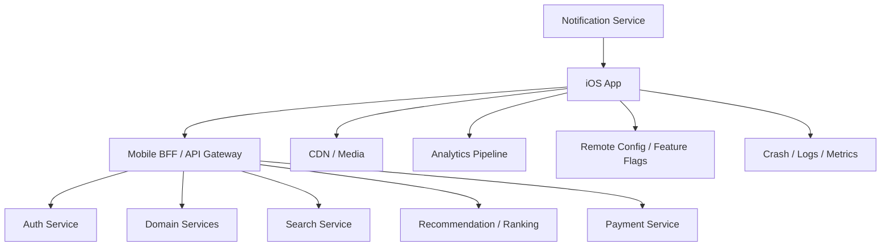

# Day 38: Generic iOS Mobile System Design Template

This is the reusable template you can follow for almost any iOS/mobile system design round. Use it for prompts like:

- Design YouTube for iOS.
- Design Amazon for iOS.
- Design Instagram feed.
- Design WhatsApp chat.
- Design Uber ride tracking.
- Design Swiggy food delivery.
- Design a banking app.
- Design a notes app with offline sync.
- Design an image loading system.
- Design a search experience.

The goal is not to memorize one answer. The goal is to follow a repeatable thinking process that shows senior-level mobile judgment.

## 0. The 60-Second Opening

Start with a crisp frame:

```text
I will design this from the iOS app outward. First I will clarify requirements and constraints, then define core user flows, high-level backend/client architecture, iOS modules and state, API contracts, caching/offline behavior, security, performance, observability, and tradeoffs. I will also call out mobile-specific constraints like poor network, app lifecycle, battery, memory, old app versions, push notifications, and App Store release cycles.
```

Why this works:

- It tells the interviewer you have structure.
- It makes the design mobile-focused.
- It prevents you from jumping randomly between backend and UI.

## 1. Clarify Requirements

Ask enough questions to scope the design.

### Functional Requirements

Ask:

- What are the main user actions?
- Which platforms are in scope: iPhone, iPad, watchOS, widgets?
- Is login required?
- Is offline mode required?
- Is real-time behavior required?
- Are payments, media, maps, chat, or sensitive data involved?
- Are admin/creator/driver/merchant flows in scope?

Example:

```text
For a YouTube-like app, I will scope to viewer experience: home feed, search, playback, comments, subscriptions, watch progress, downloads, and notifications. I will exclude creator upload unless you want me to include it.
```

### Non-Functional Requirements

Ask:

- Expected latency?
- Expected scale?
- Crash-free/session target?
- Offline expectations?
- Privacy/security constraints?
- Battery constraints?
- Accessibility/localization requirements?
- Supported iOS versions?

Senior thinking:

```text
Functional requirements tell us what to build. Non-functional requirements decide the architecture.
```

## 2. Define Core User Flows

Write 3-6 flows before components.

Generic examples:

```text
Launch -> Session check -> Home content
Search -> Results -> Details
Open details -> Perform primary action
Create/update data -> Sync -> Confirmation
Receive push -> Parse route -> Auth gate -> Navigate
Offline action -> Queue locally -> Retry sync
```

Why:

- Flows reveal modules.
- Flows reveal state.
- Flows reveal API boundaries.
- Flows reveal failure cases.

## 3. Define Scale And Constraints

Even if exact numbers are unknown, discuss assumptions.

Ask:

- How many daily active users?
- How large are payloads?
- How often does data change?
- Is content personalized?
- Do users use multiple devices?
- What regions/languages?
- Is backend already available?

Mobile-specific constraints:

- Network may be slow or unavailable.
- App can be killed anytime.
- Background execution is limited.
- App releases are slower than backend deploys.
- Old app versions stay alive.
- Battery and memory are user-facing constraints.

Senior phrase:

```text
Because mobile clients cannot be instantly upgraded, I would design API contracts to be backward compatible and use feature flags for risky rollouts.
```

## 4. High-Level Design

Draw the ecosystem.

Generic HLD:



## 5. Decide REST, GraphQL, BFF, Or Realtime

### REST

Use when:

- Domain resources are clear.
- API contracts are stable.
- Caching is useful.
- Simplicity matters.

Tradeoff:

- Multiple calls may be needed for one screen.

### GraphQL

Use when:

- Screens need flexible data shape.
- App wants to avoid over-fetching.
- Backend schema governance is strong.

Tradeoff:

- Caching and error handling can become more complex.

### Mobile BFF

Use when:

- Screen needs data from many services.
- Mobile latency matters.
- Payload should be shaped for iOS.
- App versions need controlled compatibility.

Tradeoff:

- BFF can become too screen-specific if every UI variation creates a new endpoint.

### WebSocket / Realtime

Use when:

- Chat.
- Ride tracking.
- Live sports.
- Trading.
- Collaboration.

Tradeoff:

- Harder lifecycle, reconnect, ordering, deduplication, and battery behavior.

Senior recommendation:

```text
I would choose REST/BFF for most screen data, CDN for media, push for background notifications, and WebSocket only for active realtime flows where polling is insufficient.
```

## 6. iOS Low-Level Design

Define app-side modules.

Generic module structure:

```text
FeatureView / ViewController
FeatureViewModel / Store / Presenter
FeatureState
FeatureAction
Repository
RemoteDataSource / APIClient
LocalDataSource / Store
DTO
DomainModel
ViewModel / RowModel
Coordinator / Router
AnalyticsTracker
```

Generic data flow:

```text
API DTO -> Domain Model -> View State -> Row Model -> UI
```

Why this is strong:

- API changes do not directly break UI.
- UI gets display-ready data.
- Domain logic is testable.
- State is explicit.

## 7. Model UI State Explicitly

Avoid random booleans.

Weak:

```swift
var isLoading = false
var error: String?
var items: [Item] = []
var isEmpty = false
```

Strong:

```swift
enum ScreenState<Row: Equatable>: Equatable {
    case idle
    case loading
    case loaded(ScreenContent<Row>)
    case empty
    case failed(message: String)
}

struct ScreenContent<Row: Equatable>: Equatable {
    var rows: [Row]
    var isRefreshing: Bool
    var isLoadingNextPage: Bool
    var paginationError: String?
    var canLoadMore: Bool
}
```

Senior explanation:

```text
I model initial load, refresh, pagination, and failure separately because they produce different UX. A pagination error should not erase already loaded content.
```

## 8. Define API Contracts

For every major flow, sketch request/response.

### Read API

```http
GET /ios/items?cursor=abc&pageSize=20
```

```json
{
  "items": [],
  "nextCursor": "def",
  "serverTime": "2026-07-27T10:00:00Z"
}
```

### Write API

```http
POST /orders
Idempotency-Key: attempt_123
```

```json
{
  "orderID": "o_123",
  "status": "confirmed"
}
```

### Error API

```json
{
  "code": "PAYMENT_DECLINED",
  "message": "Payment could not be completed.",
  "retryable": false,
  "requestID": "req_123"
}
```

Senior checklist:

- Stable IDs.
- Cursor pagination.
- Typed errors.
- Request IDs.
- Idempotency for writes.
- Backward-compatible fields.
- Cache metadata if useful.

## 9. Caching And Offline Strategy

Decide per data type.

| Data Type | Cache? | Source Of Truth | Strategy |
|---|---|---|---|
| Images/media | yes | CDN | memory + disk cache |
| Feed/catalog | yes | backend | cache then network |
| Cart | partial | backend | local UX, server validation |
| Payments/transfers | no casual cache | backend | idempotent writes |
| Drafts/notes | yes | local first possible | offline queue + sync |
| Tokens | secure only | auth backend | Keychain |

Senior phrase:

```text
I would not use one cache policy for everything. Product images, feed metadata, cart state, and payment state have different consistency needs.
```

## 10. Sync And Conflict Resolution

If offline writes are required, define:

- local store
- pending action queue
- retry policy
- conflict policy
- sync state

```swift
enum SyncState: Equatable {
    case synced
    case pending
    case syncing
    case failed(message: String)
    case conflicted
}
```

Conflict strategies:

- Server wins.
- Client wins.
- Last write wins.
- Field-level merge.
- Manual resolution.

Senior decision:

```text
For notes, field-level merge may be acceptable. For banking or checkout, server must win.
```

## 11. Authentication And Session Design

Cover:

- login
- refresh token
- Keychain
- biometric unlock
- session expiry
- logout cleanup
- auth-required deep links

Token refresh strategy:

```text
If multiple requests receive 401, only one refresh should happen. Others await the same refresh result.
```

Actor sketch:

```swift
actor TokenManager {
    private var refreshTask: Task<String, Error>?

    func refreshToken(using service: AuthService) async throws -> String {
        if let refreshTask {
            return try await refreshTask.value
        }

        let task = Task {
            try await service.refreshToken()
        }

        refreshTask = task
        defer { refreshTask = nil }
        return try await task.value
    }
}
```

## 12. Realtime, Push, And Deep Links

Use push for:

- app inactive
- important updates
- order status
- message notification
- security alerts

Use WebSocket for:

- active chat
- active ride tracking
- live collaboration

Deep link flow:

```text
Receive URL/push route -> parse route -> check auth -> fetch required data -> navigate -> handle fallback
```

Senior warning:

```text
Deep links should navigate to a safe screen. They should not execute sensitive actions directly.
```

## 13. Performance Design

Mobile performance topics:

- app launch
- screen load time
- scrolling
- image decoding
- memory footprint
- battery
- network usage
- player startup for video
- map rendering for tracking

Design choices:

- pagination
- prefetch
- downsample images
- cancel stale work
- avoid main-thread IO
- cache display-ready models where useful
- keep cells lightweight
- measure with Instruments

Senior phrase:

```text
I would set performance budgets for launch, first content render, API latency, and scrolling. Then I would instrument them so the team can detect regressions.
```

## 14. Security And Privacy

Always mention:

- ATS/HTTPS.
- Keychain for tokens.
- no hardcoded secrets.
- no sensitive logs.
- privacy manifests.
- secure logout cleanup.
- biometric auth if sensitive.
- app switcher/screenshot privacy if needed.
- certificate pinning only if justified.

High-risk app examples:

- Banking: session timeout, MFA, audit logs, secure storage.
- Commerce: payment tokenization and idempotency.
- Chat: encryption and private notification previews.
- Ride tracking: location privacy.

## 15. Observability And Analytics

Observability:

- crashes
- non-fatal errors
- request latency
- status codes
- decoding failures
- startup time
- screen load time
- cache hit rate
- feature flag assignment

Analytics:

- product events
- funnel events
- impressions
- taps
- conversion
- playback quality
- search behavior

Senior distinction:

```text
Analytics explains user behavior. Observability explains system health. A senior design includes both.
```

## 16. Feature Flags And Release Strategy

Mention:

- remote config
- feature flags
- kill switch
- phased rollout
- A/B testing
- app version gating
- backward-compatible APIs

Why:

```text
iOS rollback is slow. A feature flag can disable a bad feature faster than an App Store release.
```

## 17. Testing Strategy

Test layers:

- unit tests for mappers/state reducers
- repository tests with fake API/local store
- API contract tests if available
- UI tests for critical flows
- snapshot tests for complex UI if team uses them
- performance tests for scrolling/launch
- security checks for sensitive logging/storage

Example test cases:

```text
Initial load succeeds.
Initial load fails.
Cached data shown before network.
Pagination succeeds.
Pagination fails without clearing old rows.
Token refresh succeeds.
Token refresh fails and logs out.
Deep link requires auth.
Offline action queues and later syncs.
```

## 18. Tradeoff Section

Every senior answer should include explicit tradeoffs.

Use this table:

| Decision | Option A | Option B | My Choice | Why |
|---|---|---|---|---|
| API shape | REST | GraphQL/BFF | depends | based on screen composition |
| Cache | no cache | cache-then-network | cache-then-network for read-heavy data | faster UX |
| Realtime | polling | WebSocket | WebSocket active + push background | lifecycle aware |
| State | booleans | enum state machine | enum | fewer invalid states |
| Writes | normal retry | idempotent retry | idempotent | prevents duplicates |

Strong phrase:

```text
I would choose the simpler design until the product requirement forces more complexity, but I would keep the boundaries ready for growth.
```

## 19. Failure Mode Table

Always include failure handling.

| Failure | User Experience | Technical Handling |
|---|---|---|
| network offline | show cached data or offline state | reachability + retry |
| first load fails | full-screen retry | typed error |
| pagination fails | footer retry | keep existing content |
| token expired | transparent refresh | single refresh task |
| write timeout | uncertain state | idempotency/status lookup |
| push route invalid | safe fallback | route parser |
| app killed | recover state | persisted session/draft/trip/order |

## 20. Generic Final Answer Template

Use this in interviews:

```text
I would start by clarifying the main user flows and non-functional constraints. For the high-level design, the iOS app talks to a mobile BFF/API gateway, uses domain services behind it, CDN for media, push notifications for background updates, analytics for product behavior, and observability for system health.

On the iOS side, I would split the app into feature modules with clear boundaries: View/ViewController, ViewModel or Store, Repository, API client, local store, DTO, domain model, row model, coordinator/router, and analytics tracker.

I would model UI with explicit states: loading, loaded, empty, failed, refreshing, paginating, and partial failure where needed. APIs should have stable IDs, cursor pagination, typed errors, request IDs, and idempotency for write operations.

For mobile-specific concerns, I would define cache policy per data type, support offline behavior where required, handle token refresh safely, cancel stale async work, protect sensitive data in Keychain, route push/deep links through an auth-aware router, and add feature flags for safe rollout.

Finally, I would discuss tradeoffs: REST vs BFF/GraphQL, polling vs WebSocket, cache freshness vs speed, optimistic UI vs server confirmation, and local-first vs server-source-of-truth. I would close with failure modes, testing strategy, observability, and release safety.
```

## 21. Five-Minute Answer Version

If time is short:

```text
I will clarify scope, then design the app around user flows. HLD: iOS app, BFF/API gateway, domain services, CDN, auth, notifications, analytics, and feature flags. LLD: feature modules with View, ViewModel/Store, Repository, API client, local store, DTO/domain/view models, and coordinator. I will use explicit state models, cursor pagination, typed errors, idempotent writes, cache-then-network for read-heavy screens, Keychain for tokens, push/deep link routing, cancellation for stale requests, and observability for crashes/API latency/screen load. Tradeoffs depend on the product: WebSocket only for active realtime, server source of truth for money/cart, local-first for drafts/notes, and feature flags for rollout safety.
```

## 22. What Interviewers Want To Hear

They want evidence that you can:

- clarify scope
- think in flows
- separate HLD and LLD
- design iOS modules
- model state
- handle failure
- understand mobile constraints
- reason about tradeoffs
- protect security/privacy
- design for testability
- design for release safety

## 23. Red Flags To Avoid

- Only drawing backend services.
- No iOS module design.
- No state model.
- No offline/cache discussion.
- No token refresh.
- No error contract.
- No idempotency for writes.
- No push/deep link routing.
- No observability.
- No tradeoffs.
- No testing strategy.
- No mention of old app versions.

## 24. Mental Model To Remember

```text
System design for iOS = Product flows + Mobile constraints + Client architecture + Backend communication + State + Cache/offline + Security + Performance + Observability + Release safety + Tradeoffs.
```

