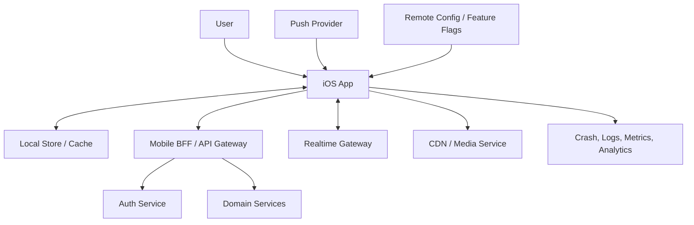
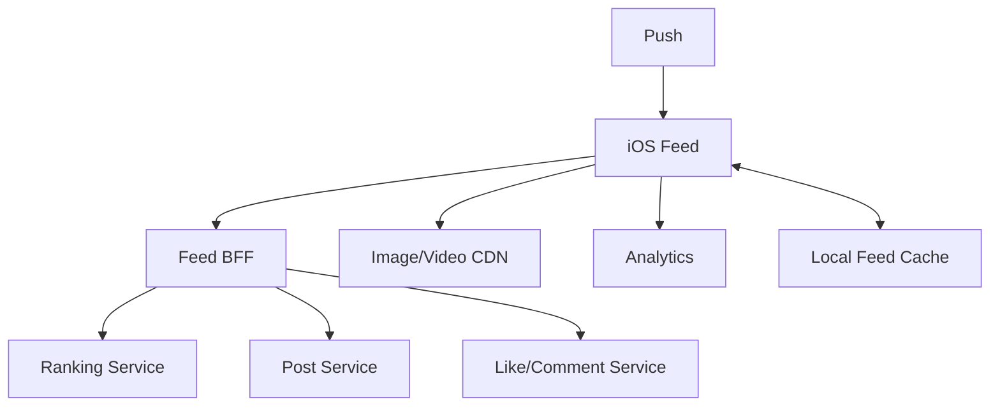

# Day 39: Mobile HLD And Client Ecosystem

High-level design in MSD explains how the iOS app fits into the larger ecosystem. You do not need to design every backend table, but you should show how the mobile app communicates with backend services, CDN, authentication, notifications, remote config, analytics, and observability.

## Generic Mobile HLD



## Components To Explain

### iOS App

The iOS app owns:

- UI rendering.
- Local state.
- Navigation.
- API calling.
- Local cache.
- Offline queue where needed.
- Permission handling.
- Push routing.
- Analytics events.
- Crash reporting.
- Feature flag interpretation.

Senior note:

```text
The client should not own business rules that require global consistency, such as payment finalization, inventory confirmation, fraud checks, or transaction approval.
```

### Mobile BFF

BFF means Backend For Frontend. It gives mobile clients screen-shaped APIs and hides backend complexity.

Use a BFF when:

- Screens need data from many backend services.
- You want mobile-specific payloads.
- You need backward-compatible app versions.
- You want to reduce app-side orchestration.

Tradeoff:

- Extra backend layer to maintain.
- Bad BFF design can become a dumping ground.

Example:

```text
For Amazon home, the mobile BFF can return banners, recommendations, cart summary, address, and deal sections in one screen contract instead of forcing the app to call five services.
```

### CDN And Media

Use CDN for:

- Images.
- Video segments.
- Static JSON configuration.
- Large downloadable resources.

iOS concerns:

- Use image resizing parameters.
- Downsample large images.
- Cache based on URL and headers.
- Support progressive loading for media-heavy feeds.

### Remote Config And Feature Flags

Remote config helps control behavior without App Store release.

Use it for:

- Gradual rollout.
- Kill switches.
- Experiment variants.
- API migration toggles.
- UI text or thresholds.

Do not use it for:

- Secrets.
- Security decisions that must be server-enforced.
- Highly complex business logic.

### Push Notifications

Push is useful for events, but not guaranteed.

Design rule:

```text
Treat push as a signal to refresh, not always as the full source of truth.
```

Example:

```text
For banking transaction alerts, the push can say "new transaction available"; the app fetches the secure transaction details after auth.
```

### Observability

A production mobile app needs:

- Crash reporting.
- Non-fatal error logging.
- API latency metrics.
- Screen load metrics.
- App startup metrics.
- Feature funnel analytics.
- Version and build tagging.

Senior note:

```text
If we cannot observe failures by app version, OS version, region, network type, and feature flag state, we cannot safely operate the app.
```

## REST vs GraphQL vs BFF

### REST

Best when:

- Resources are stable.
- HTTP caching matters.
- Teams want simple contracts.

Weakness:

- Complex screens may need multiple calls.

### GraphQL

Best when:

- Screens vary data shape.
- Product changes frequently.
- Backend schema governance is mature.

Weakness:

- Caching and performance can become complex.
- Bad queries can overfetch deeply nested data.

### BFF

Best when:

- Mobile UX needs optimized payloads.
- Backend services are fragmented.
- Old app compatibility matters.

Weakness:

- Another service to own and version.

Senior answer:

```text
For a large mobile app, I prefer a mobile BFF for screen composition and compatibility. Internally it can call REST, GraphQL, or services. The app receives stable, versioned contracts optimized for mobile.
```

## HLD Example: Instagram Feed



Explain:

- Feed BFF returns ranked feed items with cursors.
- Media URLs are CDN-backed.
- Likes can be optimistic with rollback.
- Local cache supports fast launch.
- Analytics tracks impressions with batching.
- Push can refresh notifications, not constantly update feed.

## Senior HLD Checklist

- What is the source of truth?
- Which backend layer serves mobile?
- Which operations need realtime?
- Which operations can be cached?
- Which data can be stored locally?
- Which actions need idempotency?
- What is the old-client compatibility strategy?
- How are failures observed?
- What can be controlled by remote config?

## Interview Notes

- HLD should be understandable before code.
- Mention BFF when screen composition is complex.
- Use push, WebSocket, and polling intentionally.
- Always connect backend choices to app UX.
- Senior answers include observability and rollout.
